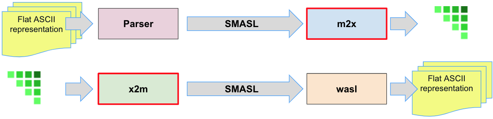
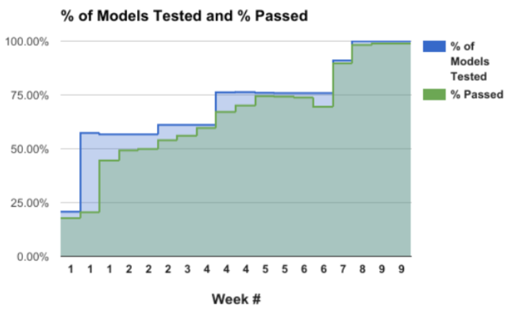
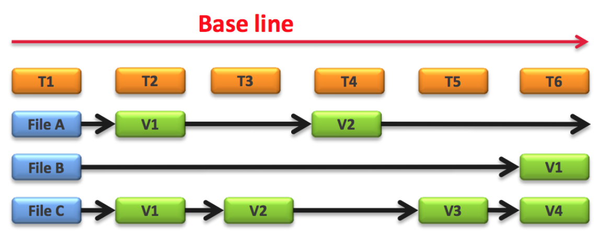

= Analyze Options for ASL BridgePoint

xtUML Project Analysis Note

:sectnums:

== Abstract

This note documents research into a migration of Shlaer-Mellor application
models from iUML into BridgePoint.  Options are explored, and observations
are recorded.

== Document References

. [[dr-1]] https://support.onefact.net/issues/10414[10414 Analyze Options for Migration]
. [[dr-2]] https://docs.google.com/document/d/1LQYNA7Zln1h8h8wbRNeZb0GukVMXLV89nSwg8SICeG4/edit[SRS - Software Requirements Specification for client Assessment]
. [[dr-3]] https://support.onefact.net/issues/8269[8269 - Raven Project Phase 1]
. [[dr-4]] http://www.ooatool.com/docs/ASL03.pdf[UML ASL Reference Guide]
. [[dr-5]] link:../8073_masl_parser/8277_serial_masl_spec.md[Serial MASL (SMASL) Specification]
. [[dr-6]] https://www.youtube.com/watch?v=lmZJ44ceDD8[OAL Context-Sensitive Content Assist]
. [[dr-7]] link:ExtractionWithHeaders.xlsx[File Formats:  Extraction with Headers]
. [[dr-8]] TBD - delivered prototype(s)
. [[dr-9]] http://www.eclipse.org/[Eclipse - IDE Framework from the Eclipse Foundation]

== Introduction and Background

As of 2017, models built with iUML and having _MASL_ (_Model and Action
Specification Language_) activities (action language bodies) can be migrated
into BridgePoint using a tool chain built for project Raven [<<dr-3,2.3>>].
In Raven, tools were constructed to convert iUML models expressed as MASL
into xtUML.  The xtUML could then be imported into BridgePoint.  Tools were
built to export xtUML models (back) into the MASL format.  A similar process
is desired for models built with iUML and having _ASL_ (_Action Specification
Language_), activities.  In the new flow, tools would be used to convert iUML
models in WASL format into xtUML.  Tools would be available to export xtUML
models from BridgePoint (back) into the WASL format.

The native iUML action language, ASL, has a syntax in the public domain.
A language reference for it can be found in [<<dr-4,2.4>>].  ASL is
fundamentally similar to _OAL_ (_Object Action Language_), the default
action language of BridgePoint, however it is a bit richer and supports
instance identity more tightly on the create statement.  There are other
advantages and disadvantages as described in <<Action Language Comparison>>.

iUML models can be represented in a form consumable by a software
architecture (model compiler) called _WACA_ (_Waterloo Auto Code
Generator and Architecture_).  This form shall be denoted _WASL_
(WACA-with-ASL).

Several paths exist to move forward from iUML/ASL.  This assessment is
intended to traverse these paths and explore different options which enable
Shlaer-Mellor Model-Driven Development to continue into future engineering
projects.  Options include changing the model editing environment and
switching to a different action language.  However, it is desired that
the back end model compiler tool chain be preserved to a large extent.

The highlights of this assessment report include:

- choice of action language
- challenge of transforming WASL to xtUML (for conversion/import)
- challenge of generating WASL from xtUML (export to model compiler)
- loss and regeneration/re-layout of model graphical diagram information
- testing and validation of the integrity of the conversions

The following figure <<wasl-flow>> will be referenced throughout the report.
Two flows are outlined, import (upper flow) and export (lower flow).  The
green triangular glyph represents xtUML.  'SMASL' is a serialized form
of Shlaer-Mellor meta-model instances.  'm2x' is a converter of SMASL
to xtUML.  'x2m' is a converter of xtUML to SMASL.  'wasl' is a converter
of SMASL to WASL.

[[wasl-flow]]

WASL-to-xtUML and xtUML-to-WASL Flows

In the following sections, the report (re)states the requirements of the
Assessment and then provides substantial analysis.  After the analysis
is a section drawing conclusions and posing recommendations.

== Requirements

Requirements for an assessment of migration options are defined in a
Software Requirements Specification (SRS) document [<<dr-2,2.2>>].
The requirements are repeated here with minor refinement.

=== (A2.1) Action Language SWOT
Analyze the relative strengths, weaknesses, opportunities and threats of
ASL versus MASL versus OAL moving forward.

=== (A2.2) ASL Editor
Explore and size an ASL action language syntax highlighting editor.

=== (A2.3) WASL2MASL
Analyze the costs and benefits of building a tool to convert WASL to MASL.

=== (A2.4) WASL2xtUML
Understand the work required to convert models from iUML-ASL (WASL) into
xtUML to be edited within BridgePoint (model conversion and import).

==== (A2.4.1) Diagram Editing
Enumerate diagram editing issues anticipated as part of model conversion
and ongoing editing of Kennedy-Carter idiom models in BridgePoint.
Include graphics issues and known differences between dialects of xtUML.

=== (A2.5) xtUML2WASL
Determine a strategy for exporting xtUML into the existing model compiler
tool chain (model export).  Determine packaging for the extraction tool
as a BridgePoint plugin, standalone tool or both.

=== (A2.6) File Formats
Isolate the interface to the model compilation tool chain and document
file formats noting that example files are supplied by the client.

=== (A2.7) Integrity
Define steps to ensure and validate the integrity of models through
the conversion process.

==== (A2.7.1) Round Trip
Explore the use of "round trip testing" to automate the import and export
and comparison of results.

=== Decision Data
For each of the above requirements, consider the following:

(A3) Sizings::
Establish relative sizings for various components and design choices.

(A4) Open Sourcing:: [Removed from scope.]

(A5) Talent Pool::
Recommend the use of internal versus external talent and the community.

(A6) Prototypes::
Develop working prototypes and/or mock ups of workflows with screenshots
leveraging supplied example files.

(A7) Training::
Recommend training in modeling and tooling or ad hoc consultation.

(A8) Configuration Management::
iUML provides change configuration inside the tool (versions of domains
and projects defined as a set of domains at a particular version).
Analysis shall propose a path to migrate a particular version of the
current application models and describe how configuration would be managed
after migration.

(A9) Model Compiler Migration::
Following UML tool migration, model compiler migration would be the
logical next step. Perform analysis and define a roadmap for this.

== Analysis

In the following analysis the challenges of a tool migration from iUML
to BridgePoint are explored.  Each requirement listed above is independently
analyzed.  Explanations provide insight into feasibility, engineering
difficulty and impact on the modelers using the tools.

Rough order of magnitude (ROM) estimates of effort are provided for many
of the options.  Note that these estimates are quite rough and based on
information available at the time.  Refinement of these estimates can be
obtained through the design process as details into implementation are
gathered.  Please use these ROM effort estimates as just that, estimates.
The estimates are presented in units of (hu)man-weeks and man-months.
Calendar time is not considered.

=== Action Language Comparison
Action language support is at the center of the challenges facing a tooling
migration.  There are at least four action language possibilities in this
migration: ASL, OAL, MASL and Alf.  Others may exist, but the ones explored
and reported here can be considered true candidates.

It is important to note that some textual action languages are able
to represent the structure of a model in addition to representing the
processing of action bodies.  For example, MASL has textual syntax to
express the structure of classes and define associations between
them.  MASL provides textual syntax to represent the entirety of
the semantics of Shlaer-Mellor models.  Graphics are an additional view
of the structural model information.  Alf is another language that supplies
syntax for activities and (some) structural model elements.  ASL and OAL
are limited to expressing action processing.  WASL extends ASL to include
a textual representation of structural Shlaer-Mellor.

[options="header"]
|===
| dialect | strengths                  | weaknesses             | opportunities   | threats
| ASL     | no change to existing flow | lack of BP interpreter | grow community  | lack of parser
|         | direct pass-thru to WACA   | not parsed (initially) | enhance BP      |
|         | smallest change to tooling | no `else if`           |                 |
|         | familiar to existing team  |                        |                 |
|         | lowest initial cost        |                        |                 |
|         | first step in any case     |                        |                 |
|         |                            |                        |                 |
| OAL     | BridgePoint native default | conversion required    | enhance syntax  | behavior differences
|         | interpreted in Verifier    | learning curve         | go mainstream   |
|         | large body of examples     | less rich syntax       |                 |
|         | alternate model compilers  |                        |                 |
|         |                            |                        |                 |
| MASL    | richest syntax             | conversion required    | expressiveness  | few users
|         | strongest typing           | learning curve         | broaden usage   |
|         | local (UK) user community  |                        |                 |
|         | proximity to Ada target    |                        |                 |
|         |                            |                        |                 |
| Alf     | standardized by OMG        | conversion required    | standardization | distraction
|         |                            | gaps in the semantics  | enhance BP      |
|         |                            | lack of BP interpreter |                 |
|         |                            | overly complex syntax  |                 |
|         |                            | learning curve         |                 |
|===

=== ASL Editor
An ASL text editor could be produced that makes the experience of editing
ASL activities pleasant and productive (in that order!).
There are multiple levels of sophistication to preparing such an editor.
Listed here are features of a syntax highlighting editor ordered from
relatively easy to more challenging to implement.

No prototypes were produced of an ASL text editor.

[options="header"]
|===
| feature                              | description                                        | parser   | ROM effort
| keyword highlighting                 | embolden and/or colorize language key words        |          | 1 week
| automatic indentation                | Indent after `if`, `else`, `loop`, etc.            |          | 2 weeks
| name validation                      | Rationalize identifiers with model elements.       | required | 1 month
| context-sensitive content assistance | auto-completion and selection lists                | required | 2 months
| rename/refactoring                   | Update activities when model element names change. | required | 4 months
|===

Syntax highlighting is relatively simple within an Eclipse environment.
A set of keywords can be defined and associated with the text editor.
Through pattern matching, the text editor highlights any of the words
found in the keyword configuration file.

Automatic indentation can be accomplished using regular expressions on a
line by line basis.  The standard text editor is extended to use a class
that supplies these rules.  An Eclipse extension exists to assist with this;
this extension has been used in the OAL editor.

Name validation is the first feature to require a parser generated
from a Backus-Naur form (BNF or EBNF) grammar of the language.
Name validation links the textual action language with the structural
elements of the language such as classes, associations, events, etc.
When parsing the activities, the names used in the action language
can be validated against the containing xtUML model.  Syntax errors
can be highlighted right away without the need to invoke the back end
compiler tool chain.  Name validation can be done "real-time" while
typing or as an overall model parse batch process.

Context-sensitive content assistance was recently added to OAL in
BridgePoint and was received with acclaim [<<dr-6,2.6>>].  The user experience
is enhanced, and the productivity improvement is measurable.  The feature
requires a parser that dynamically links to structural elements in the
model and provides lists of candidates for the next lexeme in the currently
edited action language statement.

Rename/refactoring updates action language when structural model elements
are renamed or deleted.  The feature proactively helps the user update
the actions affected by a particular model edit.  This is a complex feature
with subtleties that must be considered carefully.  Such rename/refactoring
is a feature of the MASL activity editor.

=== WASL2MASL
WASL is a textual representation of a model including both structural
and activity definitions.  WASL represents class, association, state,
and transition instances as well as action language activities.
Likewise, MASL can represent the fullness of the Shlaer-Mellor semantic
for an application model.  Both languages are derivatives of the same
methodology and roughly the same meta-model.  There is a mapping of
structural elements, and ASL activity semantics are a subset of MASL
activity semantics.  Therefore, WASL can potentially be converted to MASL.

The distinction of manual versus automatic conversion of activities
is interesting, because it is likely that WASL will be converted to
xtUML+ASL as a first step in the tooling migration process.  As such,
it will be true that WASL models will have already been converted into
xtUML+ASL by the time a MASL conversion is needed.  This leaves only
the activities to be converted.

Note this conversion is valuable only if MASL is selected as the action
language now or at some future date.  Otherwise, this conversion has limited
value (in the case of using a MASL-compatible model compiler) or no value
at all.

Options for converting WASL to MASL include manual and automatic
conversion.  Three approaches could be taken:

[options="header"]
|===
| conversion strategy                                               | ROM effort
| WASL to xtUML to MASL with manual conversion of ASL activities    | linear to the quantity of ASL
| WASL to xtUML to MASL with automatic conversion of ASL activities | 3 months (post initial migration)
| full textual WASL to full textual MASL                            | 4 months
|===

=== WASL2xtUML
Considering <<wasl-flow>>, WASL2xtUML is the conversion and import flow.
It is the top stream starting with WASL and ending with xtUML-with-ASL
editable with the BridgePoint tool.

Prototyping has confirmed that a utility called `m2x` can be leveraged.
`m2x` stands for MASL-to-xtUML.  `m2x` was built as part of Raven [<<dr-3,2.3>>].
The first step in the flow is a conversion of the input to
"serial MASL" (SMASL) [<<dr-5,2.5>>] using a parser.  Even though WASL is not
the same as MASL, the parser in the flow can be replaced to do a similar
conversion on WASL.  A prototype parser (`WaslParser`) has been written that
partially converts WASL to SMASL.  This allows `m2x` to be reused (with
a few changes) to populate the xtUML meta-model with instances representing
the input model.

[options="header"]
|===
| conversion task                                                   | ROM effort
| convert Relationships and Events test models as prototypes        | 1 month
| convert arbitrary WASL models with round trip integrity checking  | 4 months
|===

This work is required in the initial phase to accomplish automated model
conversion.  A command line interface to the conversion is necessary.

==== Diagram Editing
WASL contains no graphical diagram information.  The semantics of the
model are carried without placement, spacial or size data.  The present
understanding is that graphical information is effectively trapped within
the iUML tool.  Graphical information will need to be restored to diagrams
with a combination of automatic graphics reconciliation and manual
arrangement.

BridgePoint has the capability to perform graphics reconciliation
(generate graphics) on semantic model data.  However, the layout is
limited.  Graphical elements are positioned such that they are not
on top of each other.  Normally they are lined up side by side across
the top of a diagram canvas.  The user is left to drag the elements
(classes, states, packages) around and straighten the connectors
(class associations and state transitions).

Two connector routing algorithms are supported in BridgePoint,
`Oblique` (default) and `Rectilinear`.  Oblique routing uses a direct
routing strategy including diagonal lines.  Rectilinear routing
employs right angles.

No specific engineering is required in a model migration.  Diagram
editing and layout can be handled procedurally.

=== xtUML2WASL
Considering <<wasl-flow>>, xtUML2WASL is the export flow.
It is the bottom stream starting with xtUML and ending with the flat
ASCII representation WASL consumable by the WACA model compiler.

Prototyping has confirmed that a utility called `x2m` can be leveraged.
`x2m` stands for xtUML-to-MASL.  `x2m` was built as part of the
Raven [<<dr-3,2.3>>] project.  `x2m` converts xtUML to serialized MASL. In
the MASL flow, the serialized MASL is processed by a model-based model
compiler called `masl`.  Much of this model compiler can be reused and
its back end replaced to render WASL instead of MASL.  The resulting
executable would be called `wasl`.  (See <<wasl-flow>>.)

[options="header"]
|===
| conversion task                                              | ROM effort
| convert Relationships and Events models from xtUML into WASL | 1 month
| arbitrary xtUML-to-WASL with round trip integrity checking   | 4 months
|===

This work is required in the initial phase to accomplish automated
model conversion.  Access to this export functionality would be supplied
both to the GUI (within BridgePoint) and from the command line.

=== File Formats
WASL data is stored in a hierarchical set of directories and flat ASCII files.
The file formats have been documented by the user.  A spreadsheet containing
extracted model data with labeled header columns can be found here [<<dr-7,2.7>>].

=== Integrity
A mechanism for ensuring the integrity of model conversion was created for
MASL to xtUML and xtUML to MASL.  The mechanism recognizes that models
need to be converted in "both directions", from MASL to xtUML and from xtUML
to MASL.  Thus, a model can be converted and then converted back and compared
to the original input.

WASL can be converted to xtUML.  And then that xtUML model can be exported
as WASL.  The output WASL of the second step can be compared to input WASL
of the first step.  Allowing for non-semantic ordering and spacing, the
file contents should be identical.

This process can be automated.

==== WASL Round-Trip
_Round-Trip Testing_ automates the above integrity checks on
arbitrary sets of models.  Round-trip testing was used in a previous
project to validate the conversion process on proprietary user models
secured on a private internal network.  The user ran the round-trip
testing script on subsets of to-be-converted customer models.  Problems
were encountered.  The user crafted small, non-proprietary test models
which isolated the problem construct.  The problem was reported to the
BridgePoint engineering team along with the reproduction model.
Issues were resolved until 100% of the user model repository converted
cleanly.  See <<roundtrip-image>>.

[[roundtrip-image]]

Round Trip Testing of User Models

A round-trip testing approach can be taken with WASL.  A script can
be created which automates the conversion/import of WASL models into
BridgePoint followed by the export of WASL from BridgePoint/xtUML.
The output can be compared to the input.  A report (scorecard) can
be generated.  The scorecard can be driven to 100% success.

* The script can be run behind a secure firewall on actual user
model data.  Then results can be reported without exposing user IP.
* Small models that reproduce errors identified can be created and
added to a regression test suite.
* The process is clear and measurable and drives out defects.

=== Configuration Management Analysis

[[clearcase-flow]]

ClearCASE Revision Progression

Configuration management is supplied in the BridgePoint tool.  However,
configuration management is not a component of BridgePoint proper.
BridgePoint is built upon an Eclipse [<<dr-9,2.9>>] framework.  This allows the
engineering of BridgePoint to focus on modeling and methodology.
A separation of concerns is made between model editing/simulation/compilation
and the underlying concerns such as desktop organization, color schemes,
fonts, menu frameworks, file system access, target code compilation and
configuration management.

In BridgePoint, configuration management is supplied through an Eclipse API
called _TEAM_.  The TEAM interface abstracts configuration management away
from the specifics of particular CM implementations such as Git, CVS,
Subversion, ClearCASE, Dimensions and others.  Support for check-out,
check-in, branch, merge and the like are supported but operate on file
system resources such as files and directories.

BridgePoint persists its model data as ASCII files on the file system
(presently in an SQL syntax).  A model is logically and semantically
subdivided into Eclipse projects and UML _packages_.  This partitioning
allows models to be version-controlled in a scalable fashion that enables
teams of engineers to work in parallel at the domain level, class diagram
level or at the level of individual classes and state machines.

Note that since BridgePoint persists model data as ASCII files in an open,
accessible and documented format, users have the option of performing
configuration management idependently from the BridgePoint tool.
In such a situation no dependencies on Eclipse, TEAM and/or BridgePoint
exist.  It is comforting to undertand that user data is wide open and
can be managed in the way best suited to existing source code management
procedures.

The Eclipse TEAM API is accessed naturally while editing model elements
within the model hierarchy.  Checking out and checking in models are
accomplished in a manner consistent with other forms of source code.

=== WACA Model Compiler Migration
WACA represents valuable intellectual property (IP).  It embodies the
software architecture.  Rules of translation from Shlaer-Mellor platform
independent models (PIMs) are manifest as a separate concern.  WACA contains
no application-specific information; it is platform specific.  Multiple
applications are translated with this model compiler.

Model-based model compilation technology is advancing.  Model-based model
compilers are more portable and can be developed to generate code faster
than previous approaches.  WACA follows the traditional interpreted
archetype approach to code generation.  Effort to convert it to newer
approaches would take time and require access to the architecture source.

== Conclusions and Recommendations

As stated in <<Introduction and Background>>, there are significant
challenges to face.  However, this project has the advantage of following
after project Raven [<<dr-3,2.3>>] which shared a similar set of requirements
and produced tooling that can be leveraged to a significant extent.
The Raven project spanned roughly two calendar years with varying degrees
of engineering and engagement during that time.  A larger quantity of
model data needed to be migrated.  There was no room for flaws in the
migration process; 100% integrity needed to be achieved.  The requirements
on editing the models were similar to the present project.  A model
compiler tool chain was to be preserved; this was accomplished.

The fundamental conclusion is that a migration from iUML with ASL activities
onto BridgePoint with ASL activities is feasible.  The cost in terms of
engineering effort will be significantly lower based on work already done
in Raven and during this Assessment.

The authors of this assessment recommend proceeding with a migration and
retaining ASL as the action language during the migration.

MASL should be considered as an alternate action language at some point
after a migration.  But at the present time, reasons to switch are not
compelling.

The following sections will highlight conclusions and recommendations
item by item.  These sections are not intended to replace Software
Requirements Specifications, project plans, and Statemens of Work.
These sections simply summarize the results of the Assessment and
communicate a high level overview of recommended Next Steps.
Sizings, resource allocation and time schedules will be more accurately
provided in project documentation should such projects be commissioned.

=== Action Language
This analysis concludes that a migration staying with ASL is a best first
step even if a migration to MASL (next choice) is desired in the future.
We recommend that ASL be used as the action language for the immediate
future.  We recommend that MASL be considered after a successful migration
of existing models.

. Stay with ASL until the tool migration is complete.
. Consider MASL as a long term strategy.

=== ASL Editor
. Add keyword highlighting in the first version of the ASL activity editor.
This will avoid a sense of "stepping backwards" from the iUML activity editor.
. Add auto-indentation; it is a relatively low effort for a nice feature.
. Plan for real-time name validation and context-sensitive assistance.
. At a later time, consider the cost/benefit of rename/refactor.

Most of this work is best done by the BridgePoint engineering team.
However, it may be a consideration to explore porting the iUML simulator
to parse ASL activities to vet out syntax errors before compilation.

=== WASL2MASL
- This will be valuable if a migration to MASL is decided upon in the
future.  It is of no value otherwise.

=== WASL2xtUML
- This is core.  Perform this task in the first phase of development.
- Provide a command line interface to the conversion to support automation.
- Retain the BridgePoint engineering team for this work.

=== xtUML2WASL
- This is core.  Perform this task in the first phase of development.
- Obtain capability from within BridgePoint and from the command line.
- Retain the BridgePoint engineering team for this work.

=== File Formats
- Using the documented file formats, build a parser to consume these files
as part of WASL2xtUML conversion.

=== Conversion Integrity and WASL Round Trip
- In order to satisfy the need for high integrity in the conversion of
WASL to xtUML and xtUML to WASL, employ the round-trip strategy to achieve
a high degree of confidence in the conversion.  This also reduces risk of
wasted graphical editing effort on models that need to be reconverted.
- The tooling for this work is best done by the BridgePoint engineering
team.  Running the scripts locally is best done by a local engineer with
access to the model data.

=== Diagram Editing
1. Be certain model conversion is sound before performing manual diagram
rearrangement.
2. Consider rearranging diagram layouts as needed.  There may be little
reason to lay out a diagram that is not being viewed on a regular basis.
3. Employ `Oblique` and `Rectilinear` routing strategies during layout.
4. Employ your own engineering talent for this work due to security
clearance requirements.

=== xtUML and BridgePoint Training
It is important to ramp up tooling knowledge within the organization.
This means that knowledge transfer begins with a few and increases to
more, and that expertise exists heavily in a few and lightly in many.
There is a continuum of tooling and methodology expertise that is at
its peak (capability and cost) outside the company with consultants
and then high with a few people inside the shop and then adequate with
everyone else using the tool.

To achieve this balance a plan must be established.  Following are
recommendations to be incorporated into the training plan.

. Designate one or two internal champions now.
. Begin training up the local champion during the Assessment and through
the first phase of the model/tool migration projects.
. Use a combination of online resources and on-site training.
. Have a few engineers work through the online training materials.
. Designate a primary contact to the BridgePoint team and to the xtUML
Community including access to BridgePoint issue trackers and configuration
management repositories.
. Schedule the _Basic xtUML Modeling_ course for the champion and a few
early adopters.
. Plan to push training deeper into the organization as modeling projects
roll out.

==== Example Model
During the Raven project, it became clear that the BridgePoint development
team needed to model in the MASL dialect.  It was important that the engineers
building the tools were using the tools in that specific user mode.  Thus
the engineers could experience (both good and bad) what MASL modelers were
experiencing.  In the Raven project, this realization came relatively late.
The example model serves as another test model to run through the process,
but more importantly, it serves as editing experience.

An ASL dialect project may learn from this experience and commission an
example application model early on.  The GPS Watch is a prime candidate
for such a model.  It has already been modeled in OAL and MASL action
languages.

. Commission the creation of a reasonable application test model exhibiting
the ASL dialect.
. Build such a model in the public domain as open source and stored alongside
other xtUML applications so that users and potential users may find it.
. Consider building this model as a shared effort between both client and
supplier so that a maximum of knowledge exchange occurs.
. Choose the GPS Watch application for this effort.  It will provide the
largest return on the smallest investment.

=== Configuration Management
. Adopt a configuration management strategy that is compatible with the
version control of other source artifacts in your organization (probably
ClearCASE).
. Spend time practicing configuration management of BridgePoint xtUML models.
  - create a branch
  - check-out
  - check-in
  - merge branches
  - resolve a conflict

=== Model Compiler Migration
At this point, WACA should be preserved and reused.  Migration away from
WACA should be considered only after a successful migration of iUML
application models into new tooling.

. Protect and preserve the IP of the WACA model compiler.
. Consider options for improving the throughput and maintainability of WACA
after initial model migration has settled.
. Consider placing WACA into the public domain at some point in the future.
This may result in community engagement and additional resources maintaining
the architecture.

---

This work is licensed under the Creative Commons CC0 License

---
