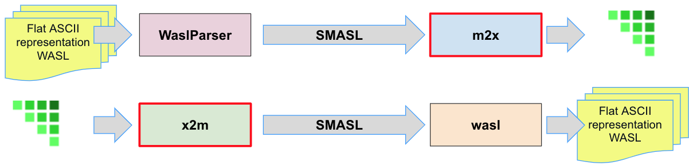

= BridgePoint WASL Migration Sizing and Sequencing

xtUML Project Analysis Note

:sectnums:
:sectnumlevels: 5

== Abstract

- I broke the .rel generation.
- I broke the import which now cycles on relationship formalization.
- data order?
- Fix class name and key letters issue.
  * Generate object stanza during relationship import.
  * [nah] It looks like Levi may been trying to solve this by caching the relationships until the objects got populated.
  * The relationship cache does not understand names and key letters.  Add this support.  The predeclaration of classes already occurs.  This can be taken out.
- Add number to object.
- Add number to SMASL.

Migration of WASL models from iUML to BridgePoint necessitates a substantial
engineering effort involving several bits of tooling and testing.  Model
conversion, import, editing, and export are to be supported in the tools.
Testing, documentation and training are required to sustain the processes.
This note serves as a top-level sizing and planning document to the various
analysis and design notes documenting the migration engineering.

== Introduction and Background

<<dr-2,2.2>> provides analysis of migration options and recommends
a path forward from iUML to BridgePoint while leveraging the existing
model compiler tool chain.  The analysis explored converting iUML models
represented as WASL flat ASCII files into xtUML and importing them into
BridgePoint.  It also explored ways of exporting WASL-idiom xtUML models
from BridgePoint to WASL to feed downstream to the model translation
build chain.  This note presumes familiarity with the contents of that
report.

== Requirements

=== Identify Tasks
=== Analyze Dependencies and Sequence Work
=== Size Tasks
=== Plan Project

== Analysis

In <<wasl-flow>> below, there are two flows.  The top flow illustrates
the convert/import from WASL flat ASCII files into BridgePoint xtUML.
The _WaslParser_ block is the substantive change in this flow relative
to the existing MASL import tooling.  The lower flow shows the export of
WASL flat ASCII files from BridgePoint xtUML.  The block labeled _wasl_
represents most of the work in the export flow.

[[wasl-flow]]

WASL-to-xtUML and xtUML-to-WASL Flows

In addition to the tooling, there are training, conversion and testing
tasks involved in the project.

=== Task Identification
This section identifies the tasks that compose the project.  Each task
is analyzed independently or together in a group of related tasks.
Sizing and sequencing come as part of the analysis.  In many cases a link
to a subordinate design note is provided for the task.

==== Training
===== Configuration Management
===== Basic xtUML Modeling
===== Tool Training
==== Meta-Modeling
===== MASL/WASL Meta-Model
====== class key letters
====== class number
====== event number
===== Enhanced Serial MASL
===== Marking
==== WASL Parser
===== Parse Domain Models
====== Type
Deal with 'typeminer'.

====== Interface and Port
====== Domain
====== Class
====== Relationship
====== State Machine
====== Terminator
====== Activities
===== Parse Build Sets
====== Deployment
==== Updates to `m2x`
==== WASL Generation
===== Export Domain
====== Type
====== Interface
====== Port
====== Domain
====== Class
====== Relationship
====== State Machine
====== Terminator
====== Activities
====== WASL Folder Structure
Containerize the output WASL files.

. domain
. object
. relationship
. associative
. subsuper
. type
. activity
. build set

===== Export Build Set
====== Deployment
==== Updates to `x2m`
===== Class Key Letters and Numbers
==== Domain Editor Compatibility
===== WASL Activity Dialect
==== Deployment Editor
==== Initial Model Migration
===== Model Conversion Trial
====== Convert Relationships and Events Models
====== Semi-Automate Model Conversion
==== Testing and Validation
===== WASL Compare Utility
====== Compare Unedited Model
====== Compare Edited Export
====== Export Existing Model to WASL
==== ASL Editing
===== ASL Syntax-Highlighting Editor
===== Auto-Indent
==== Migrate the SWATS Models

=== Sequencing and Dependency Analysis
Some tasks are independent.  Some tasks depend upon the completion of
other tasks.  An analysis is performed to outline sequencing required.

=== Sizing of Tasks
Sizing of each task is provided in the design note and carried into the
sections above.  A summary is provided here.

=== Project Planning
The analyses and design performed on the various tasks is managed in a
project plan.  Of course the project plan is refined over time as new
information becomes available.  However, since a significant analysis
has been performed, the confidence in the initial project plan can be
relatively high.

=== Convert WASL to Serial MASL (SMASL) (`WaslParser`)
=== Convert Serial MASL (SMASL) to WASL (`wasl`)

- There may be some order requirement in the .dmp file.  Relationships
need to come before object definitions (maybe).  I think that in m2x
the relationships need to be there so they can be associated with the
referential attributes.
- I think we can load/parse the `.dmp` file and process it.
This will not be complete, but it will allow for declaration of
fundamental elements that can be "filled in" by loading/parsing
the subordinate files.

== Design

=== Convert WASL to Serial MASL (SMASL) (`WaslParser`)
=== Convert Serial MASL (SMASL) to WASL (`wasl`)

- Add required new model elements to SMASL and the models.
  * Update the SMASL specification <<dr-4,2.4>>.
    + Add an attribute to 'object' to support key letters.
  * Update `m2x`, `x2m` and `masl` to account for updated SMASL specification.
    + Add an attribute to the class, 'object', to support key letters.

=== Invocation and Builders
WASL converters, importers and exporters need to be invoked with the
set of parameters appropriate to process correct input and produce correct
output.

==== `wasl2xtuml`

- Update wasl2xtuml to deal with classpaths in a DOS environment.

=== `WaslParser` and `m2x`

- Create a new WASL parser that parses structural WASL.
- Parse WASL and emit SMASL.
- Change name from asl/Asl/ASL to wasl/WaslParser/WASL.
- Honor ordering of stanzas in the .dmp file as needed.
  * Deal with order of relationships, subtypes and objects in `.dmp` file.
  * Consider updating the WASL extraction tool instead; it may be easier.
- Compile m2x for DOS (or cygwin).
- Update `maslin` to handle some information missing from input SMASL and
divine it from other sources or from defaults.
- Deal with stack size issue in m2x (`PostOooInit` 2-dim array of strings).

==== Project Level Deployments

- parse the Extraction and import projects as deployments.
- Update `m2x` to create deployments rather than project compositions.

==== File Format Questions

- What do we do with initialization segments?  (`.scn` files)

=== `x2m` and `wasl`

In regard to the ouput of WASL compatible files, the prototyping effort
provided a proof-of-concept, but did not establish a design approach for
the ultimate WASL rendering engine.  The prototype modified the MASL
code renderer, whereas the approach desired will support both MASL and
WASL.

- render operations:
  * Change name of masl render operations to 'render_masl' on elements
    that differ between MASL and WASL.
    + The top-level render operation is on 'file'.  The packaging of the
      output text is controlled by the model as well as the specifics of
      the text being packaged.
  * Supply 'render_wasl' operations.
  * When rendering MASL, invoke the corresponding tree of 'render_masl' operations.
  * When rednering WASL, invoke the tree of 'render_wasl' operations.
- templates:
  * Put templates in subdirectories `masl` and `wasl`.
  * Supply a separate set of templates for WASL rendering.
- file packaging:
  * Change containerization on MASL to be part of 'render'.
  * Containerize MASL with a query in the render process.
    + Change the name of 'file' to 'genfile', since there is a class called
      'file' in `mcooa` which is often in the same workspace.  This only
      matters when publishing references, which we want to do for the sake
      of consistency.
    + Stop populating the file with each element during the population stage.
    + Create files at the beginning of the 'render' query.
    + Create files based on the names of types of elements.
    + Deal with 'genfile::infolder' and 'genfile::outfolder' when no files
      pre-exist.
    + Put error message when invalid architecture flavor is passed in.
- Place a dialect attribute on population.

==== `xtuml2wasl`

=== Build Process

Update the build dependencies and build scripts to support the above changes.

- Add build artifacts for `wasl` that gets built from `masl`.
  * changed my mind, instead make `masl` a superset... maybe name it `mwasl`.
- Update the file movement in the releng pom file that populates
`toosl/mc/bin`.

== Design Comments

- What is domainScenarioList?

It is in addition to domainScenarios.
Maybe it is the initialization functions that are to run.

- Must edit the `.dmp` file and move the 'OBJECTS' stanza below
the 'RELATIONSHIPS' and 'SUBTYPES' stanzas.
- Must set the WORKSPACE env var when running `xtuml2wasl`.

=== Changing the Windows Build

The Windows build needs to become more consistent to the unix builds.
The windows build has had the least amount of tools and scripts.
However, the masl tool binaries are actually built on the server for Windows.
We simply do not ship them.

. xtumlmc_build.exe?
  * Copy xtumlmc_build to tools/mc/bin/xtumlmc_build.pl.
  * Change it to strip CRLFs from serial MASL stream.

== Work Required

- Provide import script:  wasl2xtuml
- Provide export script:  xtuml2wasl
- Provide testing scripts:  wasl_round_trip, wasldiff

== Acceptance Test

. Run `masl_round_trip` on the build server and see it pass %100.
. Run `wasl_round_trip` using WASL test suite ported from MASL.
It would be cheap and easy to port many of the MASL test cases... specifically, the really small isolated tests.
. Run `wasl_round_trip` using WACA test suite (SWATS).

== Document References

. [[dr-1]] https://support.onefact.net/issues/10440[10440 - Prototypes]
. [[dr-2]] https://support.onefact.net/issues/10414[10414 - Analyze Options for Migration]
. [[dr-3]] link:../10414_wasl/ExtractionWithHeaders.xlsx[File Formats:  Extraction with Headers]
. [[dr-4]] link:../8073_masl_parser/8277_serial_masl_spec.md[Serial MASL (SMASL) Specification]

---

This work is licensed under the Creative Commons CC0 License

---
