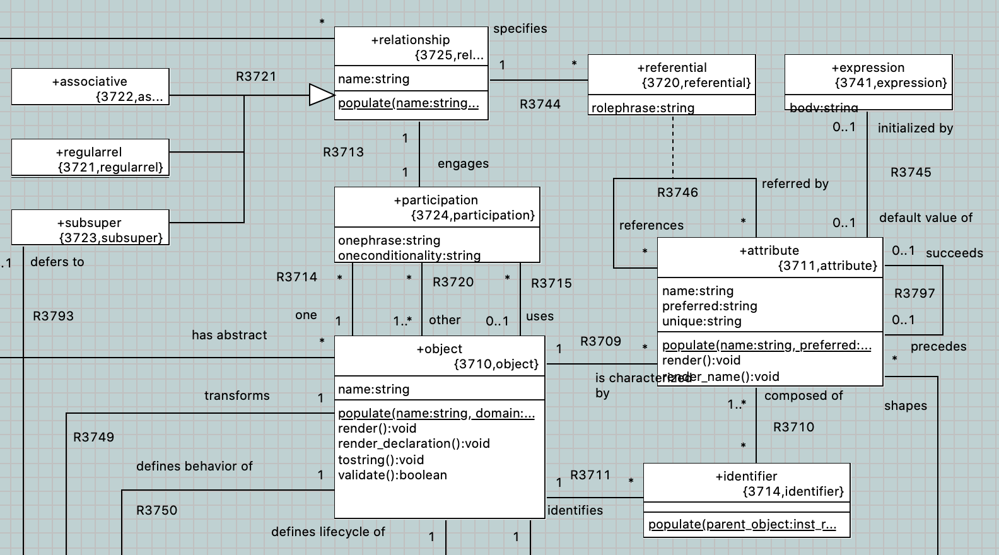
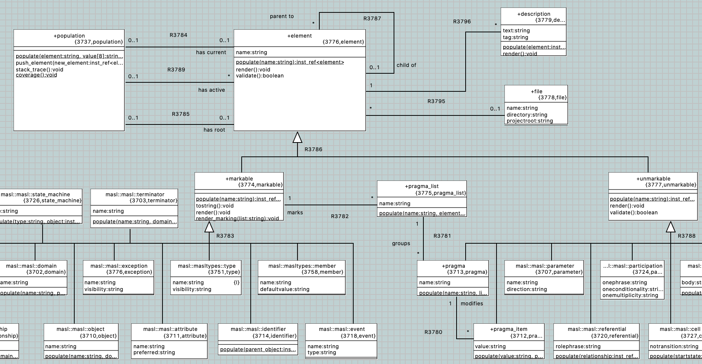

= OOA of MASL - Preparing to Parse and Load

xtUML Project Analysis Note

== 1 Abstract

A draft OOA of MASL is complete.  This note documents considerations of
the model and of parsing MASL and loading the model instance population.

== 2 Introduction and Background

See <<dr-3>> and <<dr-4>>.

== 3 Requirements

See <<dr-3>> and <<dr-4>>.

== 4 Analysis

=== 4.1 Level of Abstraction

The OOA of MASL is effectively a direct port of the underlying model of
MASL implemented in Java in the MASL model compiler.  This is both good
and bad.  The Java model is tested, tried and true.  However, it is also
closely tied to the syntax of MASL which may or may not be desirable in
an abstract model of MASL semantics.  Also, Java does not naturally
support ternary associations which are useful in xtUML.

A few constructs in particular may be improved upon without much struggle
in reducing the tie to the syntax of the language.

  * HalfRelationship versus 'participation'
  * ReferentialAttribute versus 'referential' (reflexive associative)
  * statemodel

=== 4.2 Marking

MASL supports a 'pragma' keyword as part of a statement.  This mechanism
is provided to support marking ("coloring") options on the model to govern
features supplied in a model compiler.

xtUML and BridgePoint support a 'model of marking' that allows marks to be
maintained separately from the model data.  This is done by linking named
model element references to to named model compiler features.

The future of 'pragma' should be explored.  If a loosely coupled approach
using the model of marking is desired, then a means of identifying model
elements by name or path or containment will need to be devised.

=== 4.3 Model of Syntax

MASL has a concrete syntax.  This is important.  However, the integration
of syntax and semantics in an OOA of MASL should be considered carefully.
There are techniques that acknowledge the syntax while isolating it into
a _view_ of the OOA of MASL.  The link between syntax and semantics is
critical to runtime instrumentation as well as parsing and loading.  The
concept of a __parsable element__ and the concept of _containment_ may be
of utility.  Such concepts may be applied to use of identifying attributes
in semantic model elements.

==== 4.3.1 Identifiers

Relatively natural semantic identifiers are composable from most of
_structural_ MASL.  'domain', 'project', 'service', 'attribute', 'state',
'event', 'relationship' and the like have names that make for natural
identifying attributes.  These names can be combined with _upstream_
_parent_ elements to compose unique identifiers out of naming attributes
and referential attributes.

However, this process is not so natural in the 'statement', 'expression'
and 'type' subsystems.  A particular 'while' statement does not have a name,
and the 'expression' that conditions the loop carries no natural naming
attributes.

Arbitrary identifying attributes could be introduced at this point to
establish a mechanism for relationship formalization.  However, other options
exist that may be more meaningful and provide a link between the semantics of
the model elements and the syntax of the same.

==== 4.3.2 Parsable Element

Parsing involves scanning and recognizing the textual, syntactic
representation of the model.  Parsing understands such concepts as line
and column.  Parsing also produces a consistent abstract syntax tree
that carries information usable to identify expressions at various
levels of recursive hierarchy.

It would be viable to model (in a separate view/subsystem) a class named
'ParsableElement'.  This class would be a supertype of many of the
semantic elements in the OOA of MASL.  In effect, semantic elements would
inherit information from the syntax parsing view of MASL.  This information
could be used as material for identifiers (if formalized) or more
architecturally if not formalized.

This supertyping of a model element was useful in the model of 'masl'
employed by the MASL-to-xtUML and xtUML-to-MASL conversion utilities.
See the 'maslpopulation' subsystem in the model of 'masl' <<dr-5>> and
image below.

==== 4.3.3 Containment

A natural containment hierarchy exists for MASL as it does for xtUML.  A
domain "contains" objects.  An object contains a statemodel; an object
contains attributes.  An attribute contains a type reference.  Etc.  This
containment is informally understood but not represented in the OOA model.
However, it naturally exists in the textual syntax representation.  Such a
containment hierarchy could be modeled using a number of approaches.
There are ways to superpose containment on an OOA of MASL without
corrupting the semantic view of the model.  One method uses relationships
modeled in a separate subsystem; another method uses marking data.

==== 4.3.4 Instrumentation

Monitoring, tracing and debugging rely upon instrumentation.  Instrumentation
must maintain a link between the semantics of execution and the syntax of
the underlying modeling language.  This link enables "model-level" debugging
of an implementation rendered in a lower level language.  The
ParsableElement and Containment approaches may provide linkage between the
syntax of the language and the runtime semantic execution thus
facilitating the display of model-level information during code generation
and execution.

=== 4.4 Statistics

The statistics below were gathered against the first draft OOA of MASL
extracted from the Java model in the MASL model compiler.

.Subsystem Class Count Statistics
[options="header"]
|===
| MASL subsystem       | classes | classes | xtUML subsystem
| project              |    4    |    4    | Deployment
| domain               |    4    |   12    | Domain
| * common (parameter) |    4    |         |
| * exception          |    3    |         |
| object               |    5    |   13    | Subsystem
| relationship         |    6    |   17    | Association
| statemodel           |    5    |   26    | State Model
| type                 |   26    |    6    | Type
| * builtin            |   17    |         |
| code (statement)     |   31    |   23    | Body
|                      |         |   12    | * Event
|                      |         |    4    | * Instance Access
|                      |         |    6    | * Invocation
|                      |         |    4    | * Relate
|                      |         |    6    | * Selection
| expression           |   44    |   30    | Value
| * binary             |    6    |         |
| * invocation         |    5    |         |
| * literal            |   15    |         |
|                      | *175*   | *163*   | 
|===

== 7 Document References

. [[dr-1]] https://support.onefact.net/issues/11745[11745 - Parse MASL into xtUML meta-model of MASL activity]
. [[dr-2]] https://support.onefact.net/issues/11744[11744 - AWS software architecture]
. [[dr-3]] link:11745_loadmasl_ant.adoc[analysis note]
. [[dr-4]] link:11745_loadmasl_dnt.adoc[design note]
. [[dr-5]] https://github.com/xtuml/mc/tree/master/model/masl[maslpopulation subsystem of 'masl']

.referential attribute in 'masl' model (x2m)

.MASL population subsystem]

---

This work is licensed under the Creative Commons CC0 License

---
