= OOA of MASL
Cortland Starrett <cortland.starrett@onefact.net>
:icons: font
:lecture: OOA of MASL
:table-caption!:
:example-caption!:

[.centered]
== outline

* goals
* strategy
* OOA of MASL
* MASL loader
* next steps

[.two-col]
== goals

  * capture MASL as a model
  * parse and load correct MASL
  * anticipate cloud architecture

--

--

[.two-col]
== strategy

  * port MASL model compiler java model
    ** leverage working starting point
    ** low-risk with large number of artifacts
    ** script conversion of java to MASL
    ** import into BridgePoint
  * adjust ported model
  * refine with action language

--

--

[.centered]
== OOA of MASL

  * ooamasl subsystem packages
  * package references and _naked_ OOA
  * statistics
  * deployment component (ME and canvas)
  * tour of each subsystem

== OOA of MASL:  **ooamasl packages**
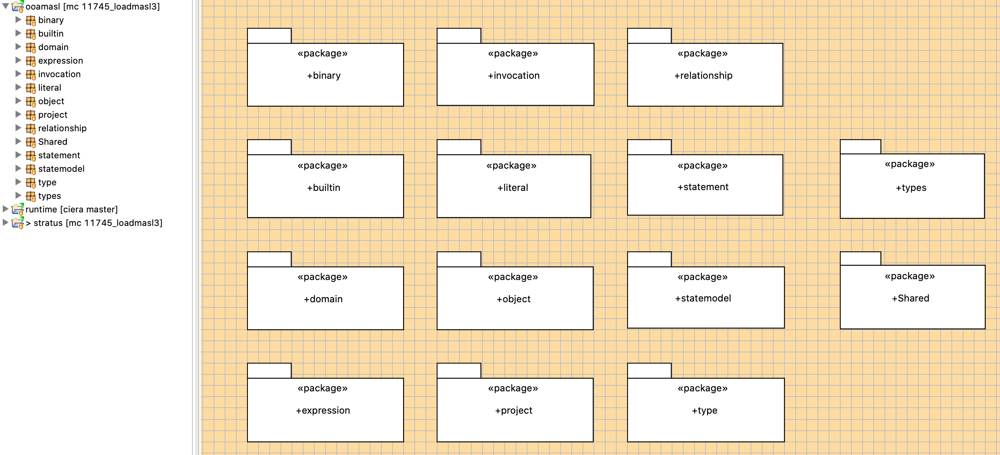
== OOA of MASL:  **binary**
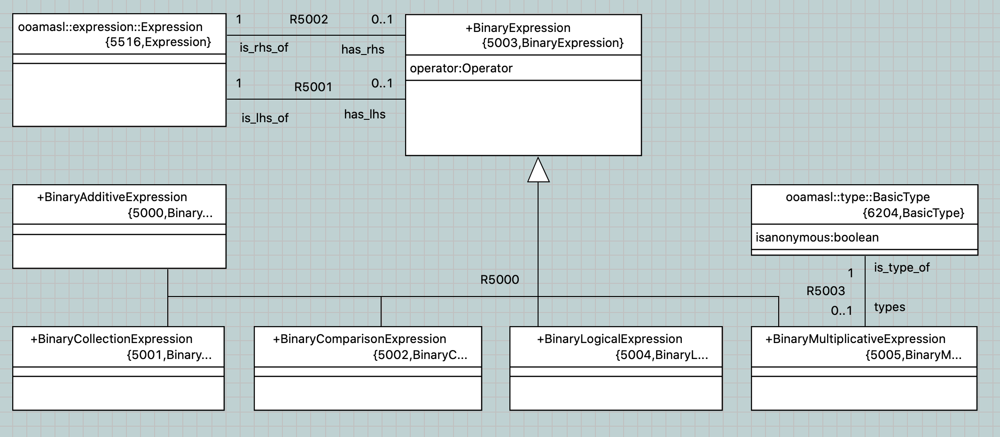
== OOA of MASL:  **builtin**
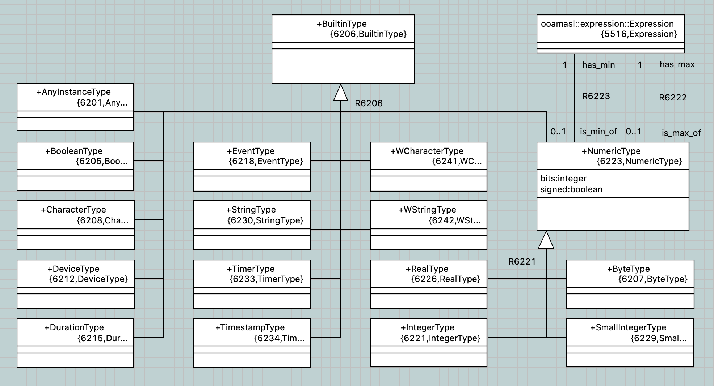
== OOA of MASL:  **domain**
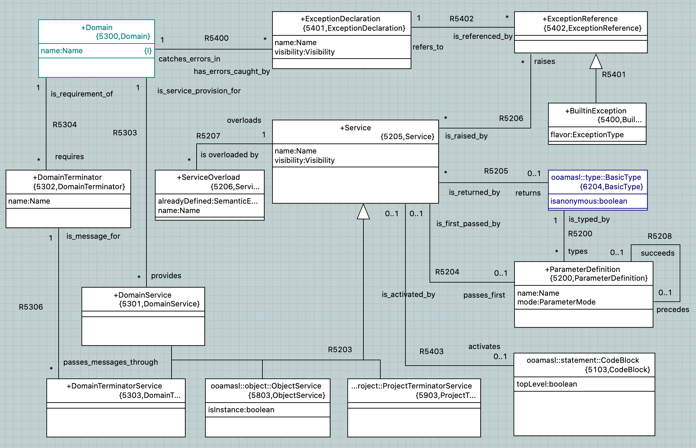
== OOA of MASL:  **expression**
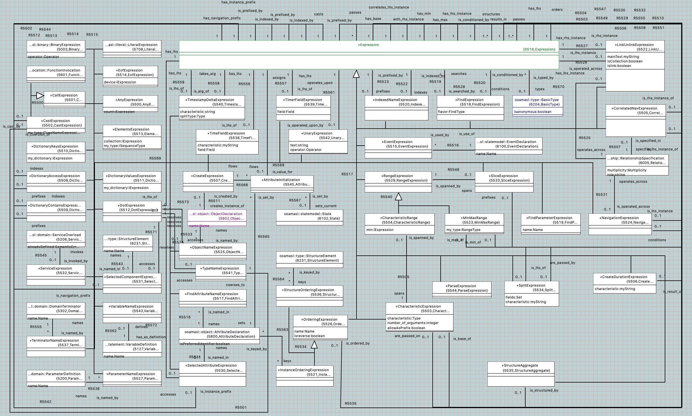
== OOA of MASL:  **invocation**
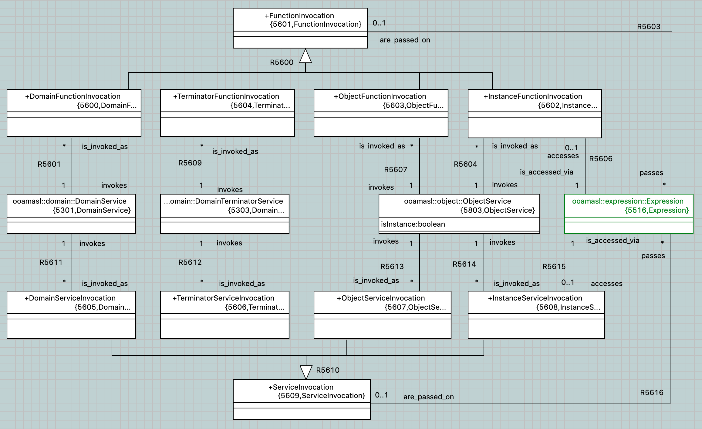
== OOA of MASL:  **literal**
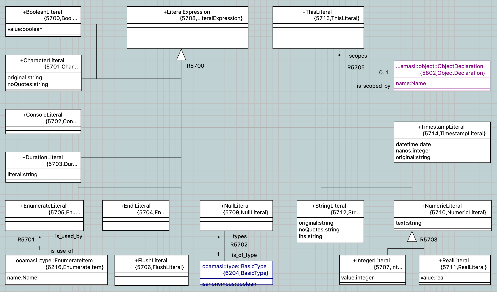
== OOA of MASL:  **object**
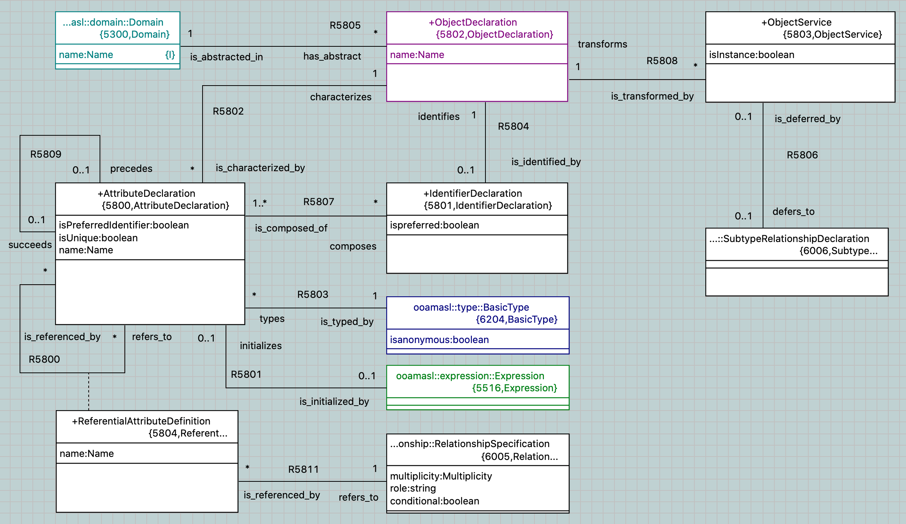
== OOA of MASL:  **project**
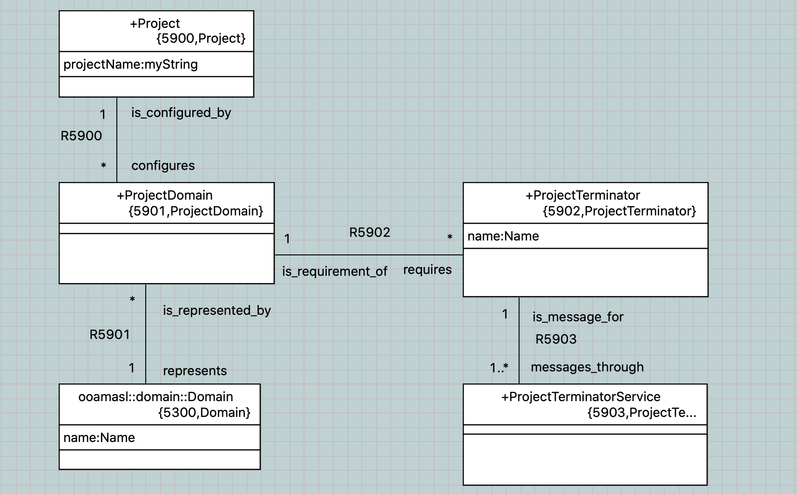
== OOA of MASL:  **relationship**
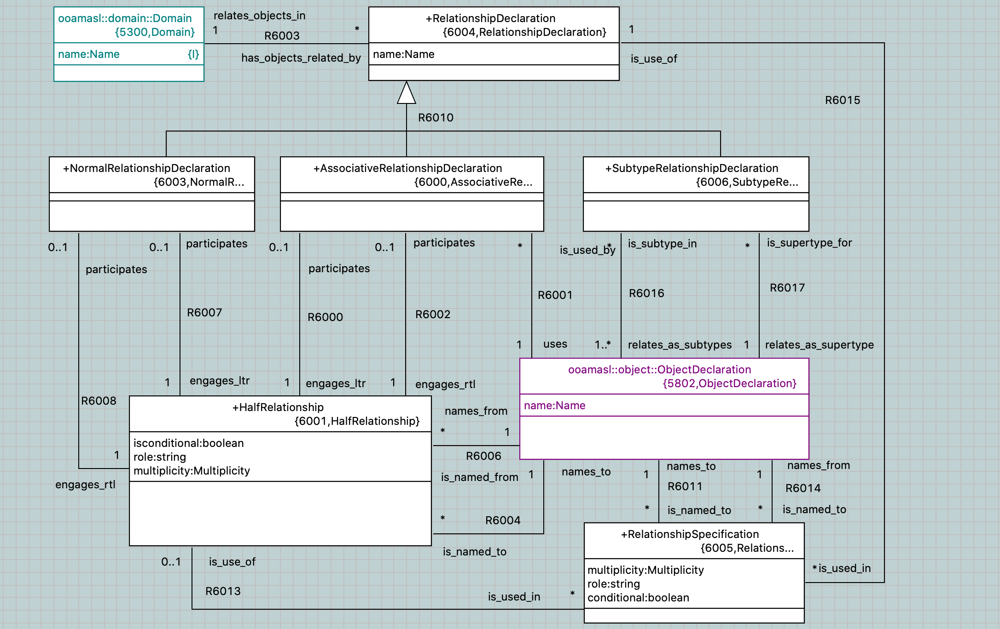
== OOA of MASL:  **statement**
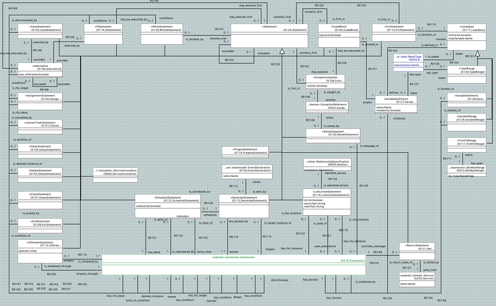
== OOA of MASL:  **statemodel**
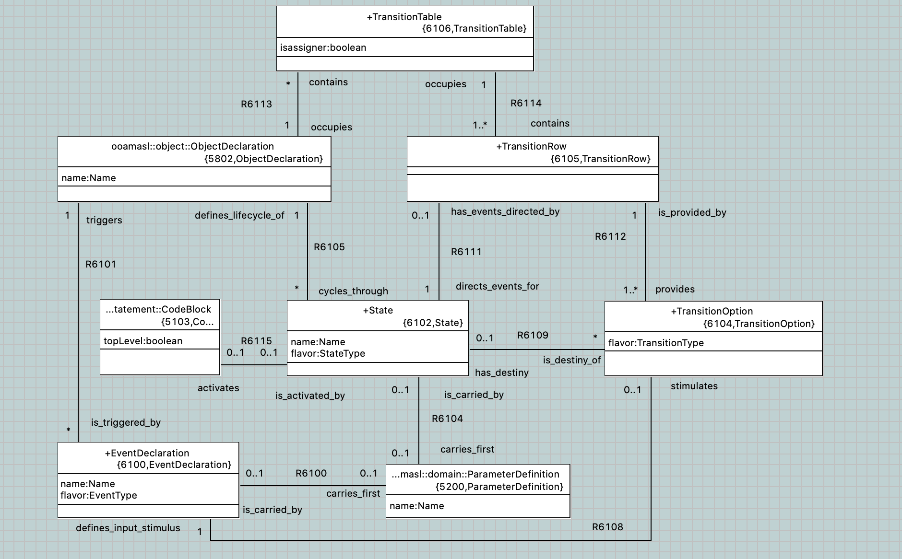
== OOA of MASL:  **type**
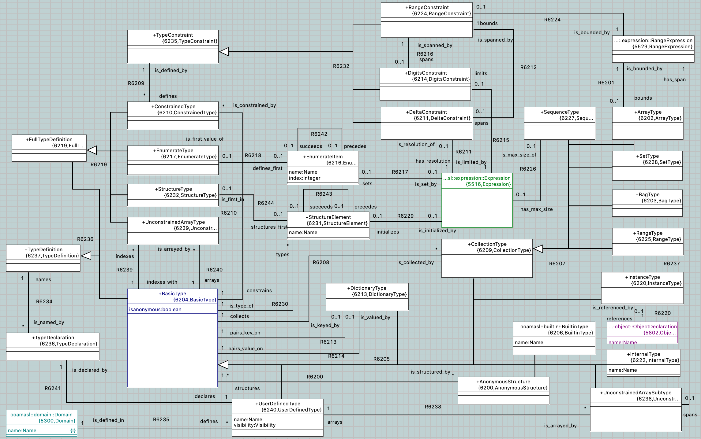

== package references and _naked_ OOA of MASL

* A package reference is a package linked to another package in another location
  (package or project).
  ** Package references allow reuse and _import_ of subsystems.
* The term _naked OOA_ refers to a class model with no state or functional activity
  intended to be used as the schema for multiple projects.
  ** A meta-model is most useful as a naked class model.

== Statistics

.Statistics
[options="header"]
|===
| subsystems       | 12
| classes          | 176
| attributes       | 117
| relationships    | 230
| production rules | 166
|===

== MASL loader

* deployment model
  ** imported OOA of MASL subsystem packages
  ** loader helper functions (OAL)
* parser as `antlr` lexer / parser
* loader as `antlr` walker with invocations into deployment model
* model API functions
  ** Ciera provides an API which allows `create`, `relate`, `set_attribute`
     and `call_function`

== OOA of MASL:  **Stratus deployment**
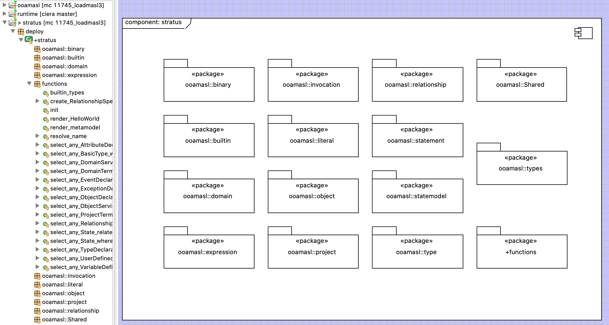

== MASL loader

  * action language functions
  * `LOAD` class interface to generated model Java
  * Ciera provides a build chain based upon `maven`.
  * Ciera generated code
  * calculator ALU has been primary test model.
  * Stratus can parse and load Stratus.
  * Generate Hello, world.
  * Generate abstract classes with stratus of stratus.
  * Generate inventory report of major elements sorted in some order.

== MASL loader: key functions

    * init
    * Builtin/InternalType_populate
    * select_any_ObjectDeclaration_where_name
    * resolve_name
    * create_RelationshipSpecification
    * ReferentialAttribute_resolve

== next steps

  * review, further test and refinement
  * template and rendering HOWTO
  * cloud template integration
  * Java translation of MASL activities
