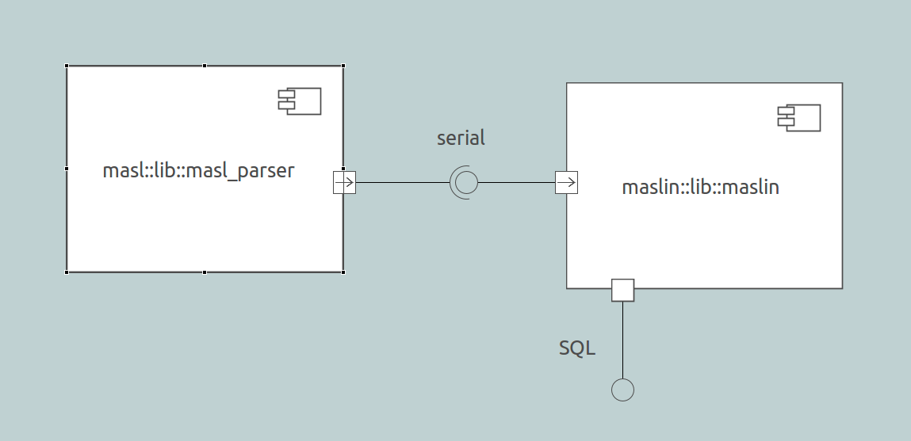
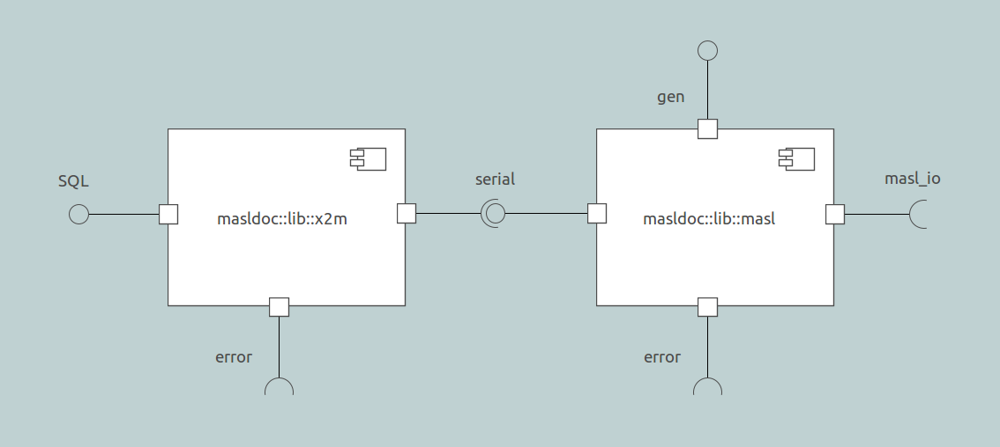
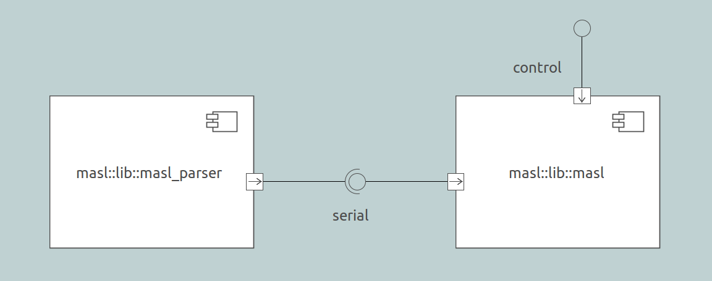

---

This work is licensed under the Creative Commons CC0 License

---

# MASL import/export packaging design
### xtUML Project Design Note


1. Abstract
-----------
The basic solution provides import/convert and export utilities for MASL models. These
utilities will need to be packaged in a build of BridgePoint to be delivered to the user.

2. Document References
----------------------
<a id="2.1"></a>2.1 [8019 Analysis note](https://github.com/cortlandstarrett/mc/blob/8019_progen3/doc/notes/8019_masl/8019_masl_ant.md)  
This is a high level analysis of the MASL project.  

<a id="2.2"></a>2.2 [8019 Design note](https://github.com/cortlandstarrett/mc/blob/8019_progen3/doc/notes/8019_masl/8019_masl_dnt.md)  
This is the corresponding design note for [[2.1]](#2.1).  

<a id="2.3"></a>2.3 [8073 Design note](https://github.com/leviathan747/mc/blob/8320_packaging/doc/notes/8073_masl_parser/8073_masl_parser.dnt.md)  
Design note for the MASL parser.  

<a id="2.4"></a>2.4 [Parser HOWTO](https://github.com/leviathan747/mc/blob/8320_packaging/masl/parser/README.md)  
HOWTO build and run the MASL parser.  

<a id="2.5"></a>2.5 [Build import/export flow](https://github.com/leviathan747/mc/blob/8320_packaging/masl/parser/README.md)  
This is the parent issue.  

<a id="2.6"></a>2.6 [MASL persistence naming conventions]()  

3. Background
-------------

For relevant background on this design, see both the analysis note [[2.1]](#2.1) and the design note
[[2.2]](#2.2) for issue #8019.

4. Requirements
---------------

All requirements from sections 4 of [[2.1]](#2.1) and [[2.2]](#2.2) apply along with the following
additional requirements.

4.1 The convert and export utilities shall be packaged in a BridgePoint plugin.  
4.2 Each of the four core components (see section 4) shall be independent of one another.  
4.3 The utilities shall have the capability to convert/export in "batch" mode.  
4.4 The components shall be "wired" together using the serial interface as specified in
the MASL parser design note [[2.3]](#2.3).  

5. Analysis
-----------

See 8019 analysis note [[2.1]](#2.1)

6. Design
---------

### 6.1 Core components

The implementation of the basic solution consists of four independently runnable components.
A description of these four components can be found in section 6.1 of the 8019 design note
[[2.2]](#2.2). The inputs and outputs of each are outlined below.

#### 6.1.1 `masl_parser`

For the description of the parser design, see the 8073 design note [[2.3]](#2.3) and the
parser HOWTO [[2.4]](#2.4).

#### 6.1.2 `masl`

6.1.2.1 Inputs

`masl` reads serial MASL from standard input until the end of the file is reached. It also takes
a validation flag.

6.1.2.2 Outputs

`masl` writes MASL to standard out. If the validation flag (`-v`) is set, it first validates the
model and writes any validation failures to standard error. If the validate only flag (`-vo`) is
set, it only validates the model (writing validation failures to standard error), outputs
nothing to standard out. Any other error messages are written to standard error.

```sh
./masl [-v | -vo] < input_file > output_file
```

#### 6.1.3 `m2x`

6.1.3.1 Inputs

`m2x` reads serial MASL from standard input until the end of the file is reached.

6.1.3.2 Outputs

`m2x` outputs xtUML text to standard out. Any error messages are written to standard error.

```sh
./m2x < input_file > output_file
```

#### 6.1.4 `x2m`

6.1.4.1 Inputs

`x2m` reads xtUML from standard input until the end of the file is reached. It also takes
a project (`-p`) or domain (`-d`) directive.

6.1.4.2 Outputs

`x2m` outputs serial MASL to standard out. Any error messages are written to standard error.

```sh
./x2m [-p | -d] < input_file > output_file
```

### 6.2 Use case flows

#### 6.2.1 Interfaces

The following illustrations reference the four core components along with five interfaces.

6.2.1.1 serial

The serial interface refers to the serial MASL interface as specified in the parser design note
[[2.3]](#2.3).

6.2.1.2 SQL

The SQL interface refers to the interface used to load and persist xtUML instance data as SQL
statements. This is the "read" and "write" of `.xtuml` files.

6.2.1.3 masl_io

The masl_io interface refers to the reading and writing of MASL text files according to the
established naming convention. These naming conventions are outlined here [[2.6]](#2.6).

6.2.1.4 gen

The gen interface refers to a control interface specific to the `masl` component. This interface
determines what to do with the model of MASL in memory once populated. It contains messages to
render and validate the model and can be extended to allow other operations on the data in memory.

6.2.1.5 error

The error interface refers to the interface to standard error. All failure messages from any of
the components will be reported to standard error.

#### 6.2.2 `masl2xtuml` (convert)


The `masl2xtuml` conversion utility will reside in a plugin in the installation and be invocable
from the command line.

6.2.2.1 Inputs

`masl2xtuml` will take as input, a project (`-p`) and/or domain (`-d`) directive followed by a list
of source directories (containing MASL projects or domains based on the directive). It will also take
an optional output directory as an argument.

6.2.2.2 Outputs

`masl2xtuml` will output one `.xtuml` file for each project/domain converted. The name of the file
will be derived from the name of the project/domain and the output `.xtuml` file will be written
in the specified output directory (or the current working directory if no output directory was
specified). If no source directories are specified, no output will be produced and the program will
exit normally. Any error messages are written to standard error.

```sh
./masl2xtuml [-p <project source directory(s) ...> ] \
    [-d <domain source directory(s) ...> ] [ -o <output directory> ]
```
(command split on two lines for readability)

#### 6.2.3 `xtuml2masl` (export)


The `xtuml2masl` export utility will reside in a plugin in the installation and be invocable
through the BridgePoint CLI or via a CME in eclipse.

6.2.3.1 Inputs

`xtuml2masl` will take as input, a project (`-p`) and/or domain (`-d`) directive followed bya list
of `.xtuml` files (corresponding to MASL projects or domains represented in xtUML). It will also
take an optional output directory as an argument, and a flag for validation.

6.2.3.2 Outputs

`xtuml2masl` will render a directory and corresponding MASL files for each project/domain exported. 
The name of the directory will be derived from the name of the project/domain exported. All
output directories/files will be written in the specified output directory (or the current working
directory if no output directory was specified). Any error messages are written to standard error.

6.2.3.3 Validation

If the validation flag (`-v`) is set, the model of MASL will validate itself before rendering and output
any validation failures to standard error. If the validate only flag (`-vo`) is set, the model will
only validate, and not render any output. Any other error messages are written to standard error.

```sh
./xtuml2masl [-v | -vo] [-p <xtUML file(s) ...> ] [-d <xtUML file(s) ...> ] \
    [ -o <output directory> ]
```
(command split on two lines for readability)

6.2.3.4 Eclipse UI

The packaging design for exporting from within BridgePoint will be covered in a separate design
note.

#### 6.2.4 `maslvalidate`


The `maslvalidate` utility will reside in a plugin in the installation and be invocable
through the BridgePoint CLI. A separate plugin for validation of MASL is necessary because
the convert flow does not naturally pass through the syntax model of MASL. In `xtuml2masl`, validation
is included "for free" because the model of MASL must be populated in order to render anyway.

6.2.4.1 Inputs

`maslvalidate` will take as input, a project (`-p`) and/or domain (`-d`) directive followed by a list
of source directories (containing MASL projects or domains based on the directive).

6.2.4.2 Outputs

`maslvalidate` will output any validation failures to standard error. Any other error messages are written
to standard error.

```sh
./maslvalidate [-p <project source directory(s) ...> ] \
    [-d <domain source directory(s) ...> ]
```
(command split on two lines for readability)

7. Design Comments
------------------

7.1 Implementation with shell scripts

Each of the use case flows will be implemented as a shell script. This approach combines convenience
and flexibility.

7.1.1 Core component design

Each of the core components was designed to be a stand alone executable that takes input from
standard input and outputs to standard output. This design naturally allows us to "wire" them up
using pipes.

7.1.2 Wiring

An example of the above concept can be seen with a possible line in `masl2xtuml` below.

```sh
MASL_DIR=masl_files/
OUTPUT_FILE=out.xtuml
java -cp build:lib/antlr-3.5.2-complete.jar MaslImportParser -p $MASL_DIR | ./m2x > $OUTPUT_FILE
```

7.2 Combination of `masl2xtuml` and `maslvalidate`

Future design may lead to assimilation of `maslvalidate` into `masl2xtuml` for purpose of simplicity of
use.

8. Unit Test
------------
See section 8 of the 8019 design note [[2.2]](#2.2).

End
---

