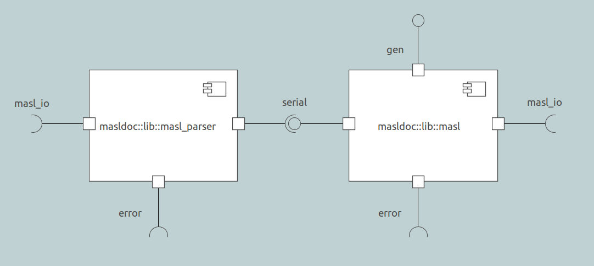

---

This work is licensed under the Creative Commons CC0 License

---

# MASL import/export packaging design
### xtUML Project Design Note

1. Abstract
-----------
The basic solution provides import/convert and export utilities for MASL models. These
utilities will need to be packaged in a build of Bridgepoint to be delivered to the user.

2. Document References
----------------------
2.1 [8019 Analysis note](https://github.com/xtuml/mc/doc/notes/8019_masl/8019_masl_ant.md)  
2.2 [8019 Design note]()  
2.2 [8073 Design note]()  

3. Background
-------------

4. Requirements
---------------

5. Analysis
-----------

6. Design
---------

### 6.1 Core components

The implementation of the basic solution consists of four independently runnable components.
A description of these four components can be found in section 6.1 of the 8019 design note
[[2.2]](#2.2). The inputs and outputs of each are outlined below.

#### 6.1.1 parser

For the description of the parser design, see the 8073 design note [[2.3]](#2.3).

#### 6.1.2 masl

6.1.2.1 Inputs

masl reads MASLDSL from standard input until the end of the file is reached. It also takes
a validation flag.

6.1.2.2 Outputs

masl writes MASL to standard out. If the validation flag is set, it first validates the
model and writes any validation failures to standard error. If the validate only flag is
set, it only validates the model (writing validation failures to standard error), outputs
nothing to standard out. Any other error messages are written to standard error.

#### 6.1.3 maslin

6.1.3.1 Inputs

maslin reads MASLDSL from standard input until the end of the file is reached.

6.1.3.2 Outputs

maslin outputs xtUML text to standard out. Any error messages are written to standard error.

#### 6.1.4 maslout

6.1.4.1 Inputs

maslout reads xtUML from standard input until the end of the file is reached. It also takes
a project or domain directive.

6.1.4.2 Outputs

maslout outputs MASLDSL to standard out. Any error messages are written to standard error.

### 6.2 Use case flows

#### 6.2.1 `masl2xtuml` (convert)

The `masl2xtuml` conversion utility will reside in a plugin in the installation and be invocable
through the BridgePoint CLI.

6.2.1.1 Inputs

`masl2xtuml` will take as input, a project or domain directive and a list of directories (containing
MASL projects or domains based on the directive). It will also take an optional output directory
as an argument.

6.2.1.2 Outputs

`masl2xtuml` will output one `.xtuml` file for each project/domain converted. The name of the file
will be derived from the name of the project/domain converted and the output file will be placed
in the specified output directory (or the current working directory if no output directory was
specified). Any error messages are written to standard error.

#### 6.2.2 `xtuml2masl` (export)

The `xtuml2masl` export utility will reside in a plugin in the installation and be invocable
through the BridgePoint CLI or via a CME in eclipse.

6.2.2.1 Inputs

`xtuml2masl` will take as input, a project or domain directive and a list of `.xtuml` files (corresponding
to MASL projects or domains represented in xtUML). It will also take an optional output directory
as an argument, and a flag for validation.

6.2.2.2 Outputs

`xtuml2masl` will render a directory and corresponding MASL files for each project/domain exported. 
The name of the directory will be derived from the name of the project/domain exported. All
output files will be placed in the specified output directory (or the current working directory
if no output directory was specified). Any error messages are written to standard error.

6.2.2.3 Validation

If the validation flag is set, the model of MASL will validate itself before rendering and output
any validation failures to standard error. If the validate only flag is set, the model will
only validate, and not render any output. Any other error messages are written to standard error.

6.2.2.2 Eclipse UI

The packaging design for exporting from within BridgePoint will be covered in a separate design
note.

#### 6.2.3 `maslvalidate`

The `maslvalidate` utility will reside in a plugin in the installation and be invocable
through the BridgePoint CLI. A separate plugin for validation of MASL is necessary because
the convert flow does not naturally pass through the syntax model of MASL. In `xtuml2masl`, validation
is included "for free" because the model of MASL must be populated in order to render anyway.

6.2.1.1 Inputs

`maslvalidate` will take as input, a project or domain directive and a list of directories (containing
MASL projects or domains based on the directive).

6.2.1.2 Outputs

`maslvalidate` will output any validation failures to standard error. Any other error messages are written
to standard error.

7. Design Comments
------------------

8. Unit Test
------------

End
---

