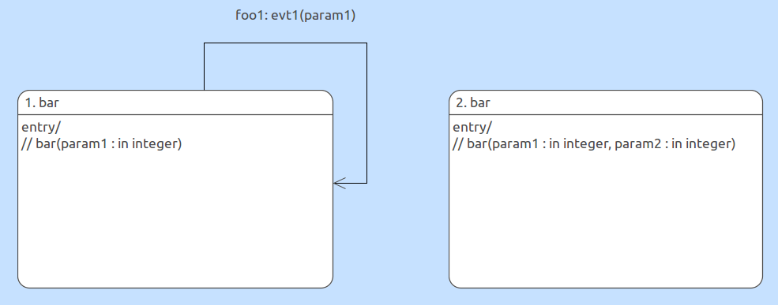

---

This work is licensed under the Creative Commons CC0 License

---

# MASL support for overloaded activities
### xtUML Project Design Note

1. Abstract
-----------
The MASL specification allows for activities in the same scope to have the same
name, provided they have unique signatures. Overloading activities must be
supported by MASL convert/import, the editor, and export.

2. Document References
----------------------
<a id="2.1"></a>2.1 [MASL reference manual](https://github.com/xtuml/bridgepoint/blob/testing/src/org.xtuml.bp.doc/Reference/MASL/LanguageReference/current/maslrefman.pdf)  
<a id="2.2">2.2 [MASL parse grammar](../../../masl/parser/src/MaslParser.g)  
<a id="2.3">2.3 [Provided test data](../../../model/masl/test_data/8322_overloaded_functions/)  
<a id="2.4">2.4 [masldiff tool](../../../masl/diff/)  
<a id="2.5">2.5 [#8322 parent issue](https://support.onefact.net/issues/8322)  
<a id="2.6">2.6 [#8510 followup issue](https://support.onefact.net/issues/8510)  

3. Background
-------------
The term "overloaded activities" shall be used throughout this note to refer to
MASL services and functions that have the same name in the same scope, but have
different signatures. See analysis section for definitions of "same scope",
"different signatures", and an explanation of the activities that support
overloading.

4. Requirements
---------------
4.1 The MASL to xtUML converter (`m2x`) shall support creating overloaded
activities  
4.1.1 No xtUML activities shall be created by the converter that have identical
signatures in the same scope  
4.2 BridgePoint shall provide capacity to view and edit overloaded activities  
4.2.1 BridgePoint shall load model data containing overloaded activities  
4.2.2 BridgePoint shall support creating new overloaded activities  
4.3 The model of MASL (`masl`) shall support exporting and rendering textual
MASL of overloaded activities  

5. Analysis
-----------

5.1 Definitions

5.1.1 Supported MASL activities

In MASL there are three types of activities: functions, services, and states.
Functions and services can be domain functions/services, terminator
functions/services, or object functions/services. All flavors of function and
service shall support overloading, states shall not.

Consider the following snippet of a MASL domain and two state diagrams:
```
object foo is
  state bar ( param1 : in integer );
  state bar ( param1 : in integer, param2 : in integer );
  event evt1 ( param1 : in integer );
  event evt2 ( param1 : in integer, param2 : in integer );
  transition is
    Non_Existent ( evt1 => Cannot_Happen,
                   evt2 => Cannot_Happen );
    bar          ( evt1 => bar,
                   evt2 => Ignore );
    bar          ( evt1 => Ignore,
                   evt2 => Ignore );
  end transition;
end object;
```



Because transition tables in MASL identify states by name (not signature), an
ambiguous situation like the above can arise. For this reason, states cannot be
overloaded.

5.1.2 Scope

"same scope" is defined as follows for each situation:

| Activity type               | Scope                                                    |
|-----------------------------|----------------------------------------------------------|
| Terminator service/function | All terminator services/functions in the same terminator |
| Domain service/function     | All services/functions in the same domain                |
| Object service/function     | All services/functions in the same object                |

5.1.3 Signatures

When a MASL activity is invoked, arguments are passed by position (as opposed to
tagged arguments as in OAL). See `argumentList` in the MASL parse grammar
[[2.2]](#2.2). Considering this, an activity signature is defined by the
activity name, the names of the parameter types in order, and the return type.
MASL services shall always be given `void` for the return type. See an example
signature below:
```
void foo(integer, string)
```

5.2 Overloading in the editor

BridgePoint currently restricts naming two model elements in the same scope
identical names. To support overloading, this restriction must be relaxed.

6. Design
---------

6.1 Population from serial MASL

Populating activities from serial MASL considering overloading is a challenge.
Because there is a declaration and a definition of each activity that gets
parsed from MASL, it is necessary to recognize when to update a pre-existing
activity and when to create a new activity. Up to this point, we have simply
identified activities by name. Now we must identify them by signature. However
this is not trivial. Consider the following snippet of serial MASL:
```
routine,,,public,foo,,,,
parameter,param1,in,,,,,,
typeref,integer,,,,,,,
parameter,,,,,,,,
routine,,,,,,,,
```
These five lines represent one MASL activity with a single integer parameter.
Since the serial MASL is processed line by line to populate the model, it is
impossible to know enough to compare signatures when the first `routine` line
comes in.

Two main approaches were considered: caching, and populate/merge.

6.1.1 Caching

The first approach considered was to delay creation of the activity. Instead of
creating an xtUML function when the first `routine` line comes in, simply cache
all of the name and parameter information in some data structure. When the
`routine` end tag comes in, all of the information would be present to compare
the signature and decide whether or not to create the new activity.

6.1.2 Populate/merge

The second approach considered was to remove the name uniqueness check for
activities and to simply allow them to be created. Then, when the `routine` end
tag comes in, compare the signatures. If a duplicate is found, the new
information is _merged_ with the existing activity and the duplicate activity is
disposed. After analysis, the only information that can be updated for
activities that would need to be merged is codeblock information.

The populate/merge approach is the chosen design because the caching approach
would required building some data structure to store the information. We already
have a model for that. The downside to this approach however is that the xtUML
meta-model is complex and this approach required us to introduce code to dispose
instances when a duplicate was found.

6.2 Editor changes

The editor has a check on the rename action to restrict duplicate names on model
elements in the same scope.

6.2.1 The xtUML meta-model has 'getSignature' operations on five classes that
can have a signature. They are _Operation_, _Interface Operation_, _Interface
Signal_, _Function_, and _Bridge_. The archetype file for the rename action will
be modified to insert a check before the unique name check. If the model element
that is being checked is a class that has a 'getSignature' operation,
BridgePoint shall not enforce the name check. In other words, any model element
that has a signature shall not be checked for a duplicate name.

6.2.2 Checking for a duplicate signature for these five elements was discussed,
however it is not altogether a trivial task. It is out of the scope of this
work, so it will be left out. A comment shall be left in the code to indicate
this decision.

6.2.3 An initial test was done to see what the implications of this change would
be particularly with respect to verifier. It was found that if two activities
have the same name, an invocation in OAL will produce a parse error. At this
time, duplicate names should only be used for producing MASL models.

7. Design Comments
------------------
During the design phase, it became clear that this issue is more extensive than
originally hoped. Below are enumerated issues that are not addressed by this
design but are blockers to the requirements of this issue.

7.1 MASL activities are stored in files. We are currently leveraging existing
code to get a unique filename based on the name of the activity. The presence of
overloaded activities breaks this mechanism because two activities with the same
name would load and persist MASL actions from the same file.

7.2 MASL projects do not provide much to the model except to override terminator
services and functions from the domains. In the xtUML/MASL idiom, this is
represented by a set of interface references that are formalized with interface
definitions in the separate domain projects. Because the project does not have
any access to the model data of the domains at convert time, the loader has been
modified to search the workspace for interface definitions and formalize them by
matching the names. In order to make sure the activity files are copied to the
right place in the model data, a mapping of activity names and activity files is
stored in the unformalized interface reference. This mechanism is broken because
of overloaded activities because activity names are no longer a unique key for
this mapping.

7.3 Activities with duplicate names are not supported in the OAL parser or the
verifier.

Issues 7.1 and 7.2 block the requirements of this design. More analysis will be
required to provide solutions to these problems, however work implemented
according to this design is still a step forward. The work will be completed as
designed, however an issue will be raised to revisit these remaining issues
[[2.6]](#2.6). Analysis will also be done to determine the work required to
fully support overloaded activities in OAL. This note will be referenced in all
future work on these issues.

8. Unit Test
------------
Test data was created that exercises each of the supported activities (services
and functions) in each of the scopes (terminator, domain, object). This data can
be found at `/model/masl/test_data/8322_overloaded_functions/` [[2.3]](#2.3).

8.1 For each of the test cases do the following:  
8.1.1 Convert the MASL to xtUML with the `masl2xtuml` tool  
8.1.2 Import the converted model into BridgePoint  
8.1.3 Examine the model and verify that the activities were created as you
expect  
8.1.4 Export the model to MASL  
8.1.5 Compare the output MASL with the source MASL using the `masldiff` tool
[[2.4]](#2.4). There should be zero diffs.  

8.2 Test the BridgePoint editor. For each of the three scopes (domain, terminator
object):  
8.2.1 Create two functions with the same name and different signatures in a MASL
idiom xtUML project  
8.2.2 Export the model to MASL  
8.2.3 Examine the resultant MASL and verify that the activities were created as
you expect  

End
---
