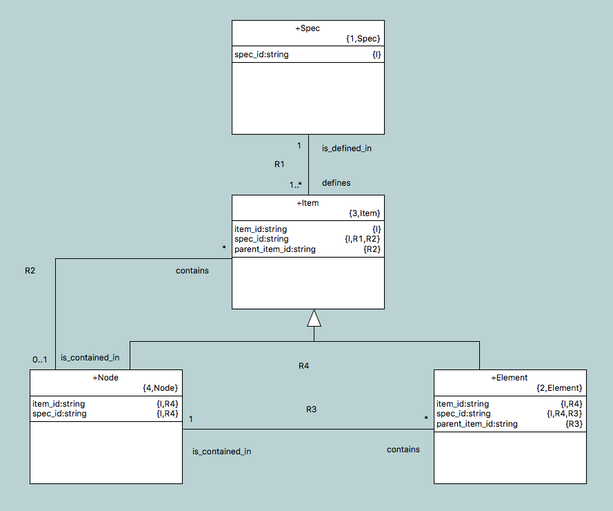

---

This work is licensed under the Creative Commons CC0 License

---

# Duplicate referential attribute specs
### xtUML Project Implementation Note

1. Abstract
-----------
The user reported a bug wherein the test model [[2.2]](#2.2) was failing round
trip equality. In two instances, the relationship specification for a
referential attribute was duplicated.

2. Document References
----------------------
2.1 [#9192 duplicate referential attribute specs](https://support.onefact.net/issues/9192) headline issue  
2.2 [#9159 Attribute missing from identifier](https://support.onefact.net/issues/9159) related issue  
2.3 [#9206 Referential attribute going missing](https://support.onefact.net/issues/9206) related issue  

2.4 [#9189 duplicate referential attribute specs](https://support.onefact.net/issues/9189) internal issue for 2.1  
2.5 [#9149 Attribute missing from identifier](https://support.onefact.net/issues/9149) internal issue for 2.2  
2.6 [#9207 Referential attribute going missing](https://support.onefact.net/issues/9207) internal issue for 2.3  

2.7 [9192_dupref](https://github.com/xtuml/models/tree/master/masl/test/9192_dupref) test model for 2.1  
2.8 [9149_id](https://github.com/xtuml/models/tree/master/masl/test/9149_id) test model for 2.2  
2.9 [9206_refmiss](https://github.com/xtuml/models/tree/master/masl/test/9206_refmiss) test model for 2.3  

3. Background
-------------
Analysis of the headline issue narrowed down the problem to the MASL to xtUML
conversion (`m2x`). The issue ended up being related to combining referentials.
When referentials are combined, one attribute is "collapsed into" the other. The
references from the one attribute are added to the other and then the one
attribute is discarded.

Previously, the `postProcess` operations was collapsing the older referential
attributes into the newly created referential attribute. This was causing
problems because sometimes the older attribute was referred to by other
referential attributes and when it was deleted the referring entities were not
properly hooked up to the new referential attribute it was combined with and
this was not being handled properly.

Consider the following test model:

R1 is formalized first, then R4. "spec_id" is propagated to the "Node" class.
When R2 is formalized, "spec_id" is propagated back into "Item" and must be
combined with the "spec_id" that is already there. The proper way to do this is
to collapse the copy of "spec_id" from R2 into the one from R1. This will
prevent information from being lost.

Through testing and analysis, it was found that this problem was the root of
issue #9159 [[2.2]](#2.2) and #9206 [[2.3]](#2.3)

4. Requirements
---------------
4.1 Round trip shall pass for [[2.7]](#2.7)  
4.2 Round trip shall pass for [[2.8]](#2.8)  
4.3 Round trip shall pass for [[2.9]](#2.9)  

5. Work Required
----------------
5.1 Switch the arguments in the call to `ReferentialAttribute_combine_refs`  
5.1.1 Re-assign `o_attr` to be the older referential attribute  
5.2 Change the order of `postProcess` to combine refs before adding to
identifiers to avoid unnecessary addition to an identifier if a referential
attribute is going to get combined  
5.3 Added code to maintain user order of attributes  

6. Implementation Comments
--------------------------
6.1 Because we create base attributes for every attribute on the first pass and
then replace those attributes with referential attributes, the order of
attributes in the users model is not always maintained. This does not affect
functionality, but it would be nice if the order survived the conversion. Code
was added that takes care of this before the base attribute is deleted.

7. Unit Test
------------
7.1 Round trip for [[2.7]](#2.7)  
7.2 Round trip for [[2.8]](#2.8)  
7.3 Round trip for [[2.9]](#2.9)  

8. User Documentation
---------------------
None

9. Code Changes
---------------
Fork/Repository: leviathan747/mc  
Branch: 9192_dupref  

<pre>

 bin/m2x                                                                        | Bin 683472 -> 683472 bytes
 model/maslin/models/maslin/m2x/ooapopulation/ooapopulation.xtuml               |  66 +++++++++++++++++++++++++++++++++++++++++++++++++++++++++++++++++-
 model/maslin/models/maslin/m2x/referentialAttribute/referentialAttribute.xtuml |  37 ++++++++++++++++++++++++-------------
 3 files changed, 89 insertions(+), 14 deletions(-)

</pre>

End
---

