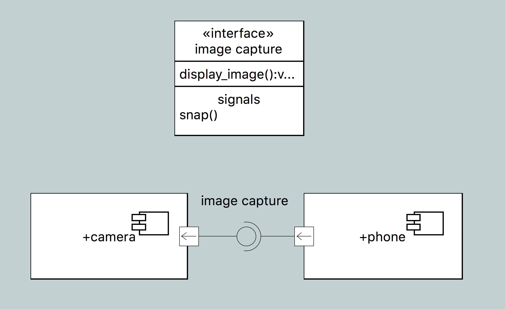
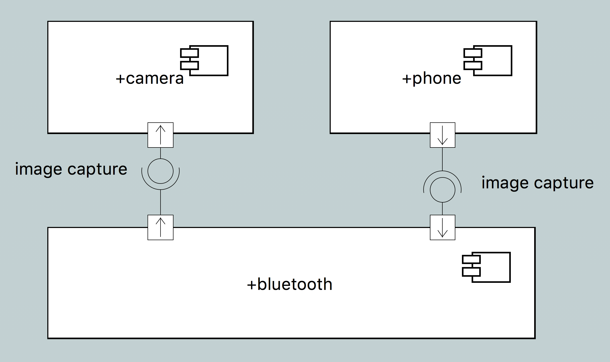
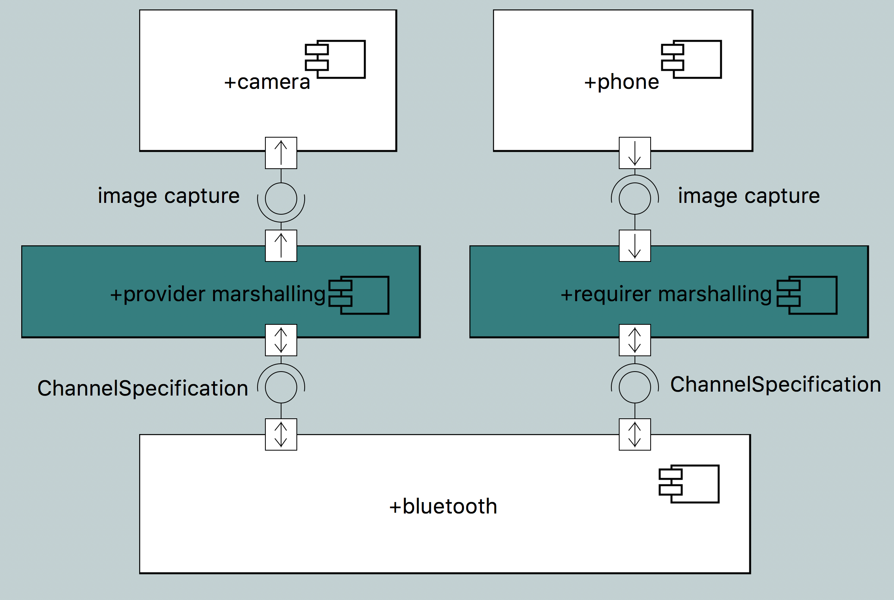
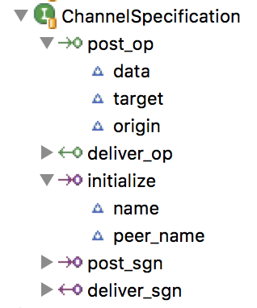
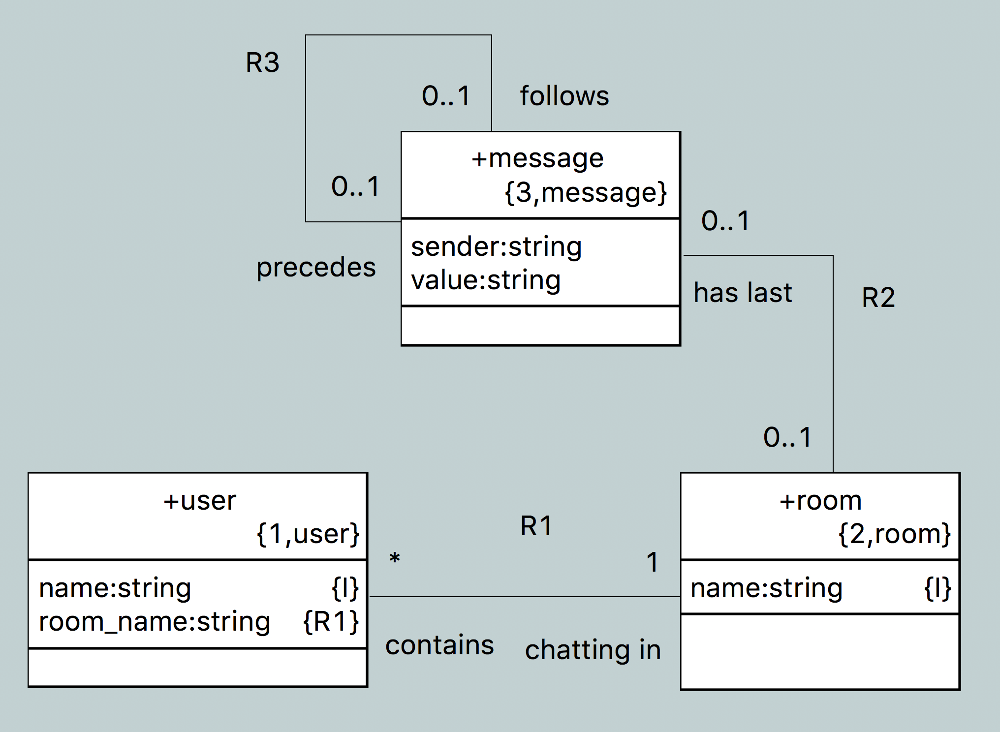
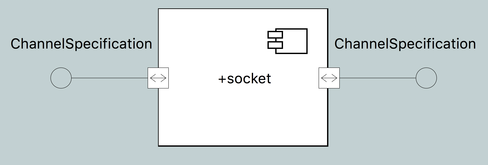
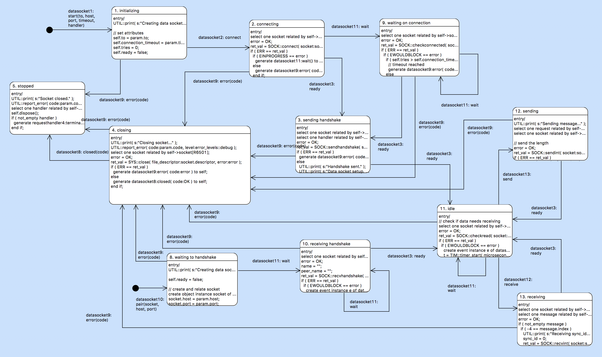
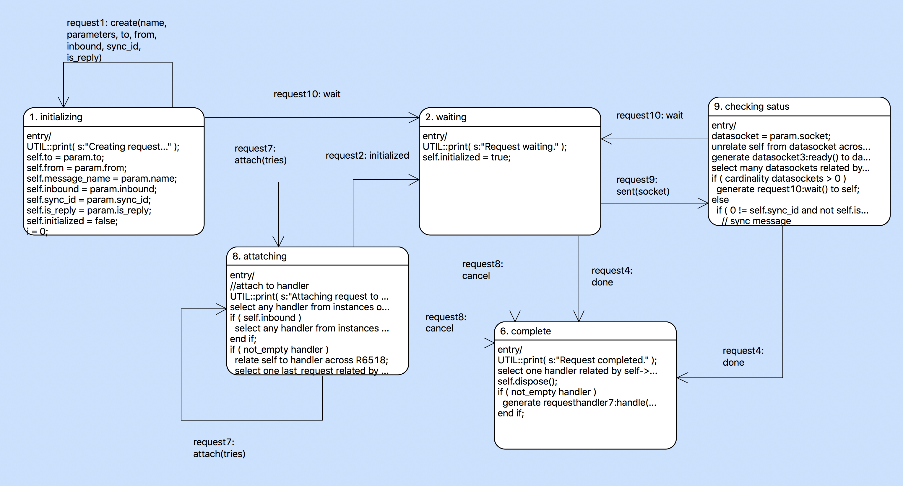

---

This work is licensed under the Creative Commons CC0 License

---

# Channel Modeling
### the benefits of abstract communication

### 1. Abstract

Channel communication is an important issue in modeling systems. Modeling
communication can raise the level of abstraction and clearly separate
architecture from application.

### 2. Document references

2.1 [MC3020 (xtUML C compiler)](https://github.com/xtuml/mc/tree/master/arc)  
2.2 [webchat model](https://github.com/xtuml/models/tree/9538_ipc_experiment/applications/webchat)  
2.3 [socket model and ChannelSpecification interface](https://github.com/xtuml/mc/tree/9538_ipc_experiment/model/mcshared) -- `mcshared` model under "mcshared::channel"  

### 3. Background

xtUML allows software engineers, system designers, and domain experts to
communicate clearly at a highly abstract level and collaborate effectively to
produce implementations of complex systems. Subject matters are separated
logically into domains where their behavior is modeled independently.  Domains
are wired together through a clearly defined set of interfaces. Model compiler
designers encode architectural patterns and details into model compilers which
consistently produce code for a target architecture over a long time on any
number of application models.

It is good to maintain separation of concerns in modeling. Architectural
details belong in the compiler, and the application model should remain clearly
focused on the domain requirements. Unfortunately, in the area of message
passing, the concerns can easily get mixed. A communication channel is central
to many applications. Devices must communicate with a hub, an application could
consist of many distributed nodes on a network, processes must communicate
through a host operating system. Communication protocols arise in application
models alongside higher level application concerns. Should they be in the
application models or the model compiler? Modeling communication protocols
provides the benefits of clarity and aided understanding and debugging.
Encoding communication protocols into a model compiler facilitates reuse and
protects the integrity of application models.

We can see a logical third layer of abstraction appearing in this modeling
paradigm. We need a way to model applications (highest layer), model
communication protocols separately (middle layer), and produce a system from
both using a model compiler (lowest layer). This is not a new phenomenon in
modeling. In the Shlaer-Mellor method, lower level reusable domains are called
"service domains". Consider The following architectural diagarm of a weather
station model:

In this diagram, the domains are organized into application and service domains
with the architecture below both. You can see how the service domains may be
modeled, but are logically not at the same level of abstraction as an
application.

### 4. Benefits of abstract communication

4.1 Portability

One of the most compelling benefits of modeling communication in xtUML itself
is the ease of use across multiple applications _and_ multiple architectures.
If protocols are modeled in xtUML the same way as application models, the model
compiler is capable of producing code for the target architecture in the same
way. Imagine building one model of HTTP and applying the model to an interface
between a phone app and a wireless security camera, then applying it again to a
modeled web service running on a Linux server.

4.2 Abstraction

Communication is a complex and often stateful domain. All of the benefits of
using xtUML in modeling systems apply equally to modeling communication.
Raising the level of abstraction removes silly errors and allows engineers to
reason about the completeness and correctness of models.

4.3 Flexibility

In complement to section 4.1, modeling communication in xtUML provides maximum
flexibility. Instead of a finite number of communication options provided by a
model compiler, a infinite number of communication implementations is available
and limited only by the imagination of the engineers who model them.

### 5. Logical implementation of data channels

One way that has been used in the past to solve the problem of modeling data
channels is through intermediate components. For example, consider the diagram
below:

In this system, `camera` and `phone` are connected over an interface `image
capture`. They are able to pass messages back and forth through simple call and
return, however if `camera` and `phone` are running in different processes or
even on different machines, there would be no way to communicate. Now consider
this diagram:

In this new system, the analyst has interposed `bluetooth` between `camera` and
`phone`.  The analyst can implement the delivery mechanism inside `bluetooth`.
`camera` and `phone` maintain the ability to talk on interface `image capture`,
and the problem seems to be solved.

This solution although effective is not optimal for two reasons. Firstly, the
analyst has polluted his application model with service domain details. The
`bluetooth` component is not at the same logical level as the abstract system
model and does not belong in a diagram alongside `camera` and `phone`.
Logically, `camera` and `phone` communicate over interface `image capture`,
however this solution exposes low-level particulars about how messages are
actually passed in the system. Secondly, the `bluetooth` component is forced to
be specific to the interface it implements and cannot easily be reused in other
application models. To work properly, `bluetooth` must implement the `image
capture` interface as a provider and requirer. Although `bluetooth` could be
designed such that the internal behavior could be copied into any number of
in-between components, this is not the optimal solution.

Examine this system model of a weather station with many components:

Although complex, the connections between the components are clear and easy to
understand.  Now imagine that we wanted to model the delivery mechanisms for
each interface and interposed a component reference for each interface:

Not only does this more than double the number of component references on our
diagram, but it makes it much more difficult to see which components
communicate with one another at a glance.

How can we combine the concept of an in-between component and apply it to our
models such that they appear as the first `phone`/`camera` system?

This diagram represents **_logically_** the proposed method of modeling data
channels. Like the second diagram, `bluetooth` is interposed between `camera`
and `phone`, and `camera` and `phone` both continue to talk across interface
`image capture`. In this solution, additional components `provider marshalling`
and `requirer marshalling` (marked in teal) are inserted between `camera` and
`bluetooth` and `phone` and `bluetooth` respectively. These "components" are
generated by the model compiler at the time of compilation and placed between
`camera` and `phone` and the selected delivery component. Note that `bluetooth`
implements a new interface `ChannelSpecification`. This interface remains
consistent across every component which models delivery and therefore
facilitates reuse of these delivery components. The "marshalling" components
are generated by the model compiler, and their responsibility is to pack the
messages with parameters into a consistent format and pass them through the
`ChannelSpecification` interface to the delivery implementation component. On
the other side, they unpack the data and reconstruct a call across the
interface `image capture`.

Using this pattern an engineering team could model system that looks like the
first diagram, model a transport component, and then mark the interface as
being "implemented by" the transport component. At compile time, code would be
generated to fill the gaps and connect `camera` and `phone` to the transport
component using the `ChannelSpecification` interface.

### 6. The `ChannelSpecification` interface

The `ChannelSpecification` interface provides the following signals and
operations:
* `post_sgn` 
* `post_op`
* `deliver_sgn`
* `deliver_op`
* `initialize`

6.1 Implementation

A component that models a communication channel is expected to have at least
two provided ports `REQ` and `PROV`, both formalized to the
`ChannelSpecification` interface.

6.1 `post_sgn`

`post_sgn` is a to-provider signal that must be implemented by the ports of the
communication component. The parameters are as follows:  
* `data`: A data structure that contains a data buffer and an integral size  
* `target`: an identifier for the target of the message  
* `origin`: an identifier for the origin of the message  

On receipt of the `post_sgn` signal, the implementation is expected to pass the
data and invoke `deliver_sgn` on the target. For example, `phone` calls
interface `image capture` signal `snap`. `phone` is the requirer, so `post_sgn`
on the `REQ` port of the implementation component will be invoked. In the most
simple case, the body of `post_sgn` can directly invoke `deliver_sgn` on the
`PROV` port. In practice, the data will pass through some delivery mechanism
(e.g. a bluetooth enabled hardware interface) before reaching the requirer
side.

6.2 `post_op`

`post_op` is a to-provider operation that must be implemented by the ports of
the communication component. Its parameters are the same as `post_sgn` and its
semantics are the same except that it is a synchronous message that must return
a value. The value that is returned is a list of data values that represent the
return value and the values of the "by reference" parameters of the original
operation.

6.3 `deliver_sgn`

`deliver_sgn` is a from-provider signal that is implemented in the model
compiler. When this signal is invoked from within a channel implementation
component, the parameters are reconstructed from the data values and the
original signal is called on the application component. The parameters are
identical to `post_sgn` and `post_op`.

6.4 `deliver_op`

`deliver_op` is a from-provider operation that is implemented in the model
compiler. Like `post_op`, it has a return value that represents the return
value of the original signal, and the values of the "by reference" parameters.

6.5 `initialize`

`initialize` is a to-provider signal that can be optionally implemented by the
ports of the communication component. The compiler places an invocation of this
signal in the initialization routine of both application components. This
signal allows any setup to occur before signals are sent across the interfaces.
Its parameters are as follows:  
* `name`: an identifier for the port which is being initialized  
* `peer_name`: an identifier for the port with which the initialized port is
  satisfied  
These parameters allow the communication component to properly map signals to
the correct destinations. Any additional data that is needed to complete
initialization (e.g. addresses, ports, MAC addresses) is the concern of the
modeler -- that is, the model compiler does not pass any additional data
parameters.

### 7. Marshalling/Unmarshalling

One important aspect of communication is the marshalling (packing) of data into
a consistent form suitable for message passing. There are many ways to do this.
A previous prototype of structured messaging over sockets in the C model
compiler generated a C `struct` for each interface message. Parameters were
loaded into the `struct` and on the receiving end, the data was cast into a
variable of the `struct` type. This works well and is intuitive and readable,
however it causes a proliferation of data types (one per interface message).
Another way is to treat arbitrary data as strings and pack the bytes into a
character array. This prevents types from proliferating and is simple, but can
waste space on the stack for statically allocated strings.

Other methods of implementing marshalling can be used. In this design, the
marshalling is a concern of the model compiler and not the model of
communication itself.

### 8. Case study: sockets and web chat

This method of modeling communication channels at an abstract level has been
prototyped in MC3020 [2.1]. A component called `socket` has been introduced
which models communication using the POSIX socket API and an application
"webchat" has been modeled to demonstrate the technique.

8.1 webchat

The webchat application consists of two simple components. The `user` component
represents a user connected to the chat server. The `chat` component represents
the chat server backend itself. Note that the `chat` component is the provider
and the `user` component is the requirer. This application is designed such
that many `user`s can connect and communicate through one `chat`

The `chat` component contains a data model of users, rooms, and messages

The `user` component contains a state machine to receive messages and wait for
user input

A model compiler mark is used to specify which component implements which
satisfaction of interfaces. The satisfaction label is used as the identifier

8.2 `socket`

The socket component follows the pattern of an implementation of a channel
according to the interface specification above -- it has two provided ports
(`PROV` and `REQ`) both formalized to the `ChannelSpecification` interface.

A fairly involved data model represents the internal structure of the socket
component

State machines for data sockets, requests, and couriers (clients and servers)
model the behavior and life cycles of the abstract objects

data socket

request

courier

An external entity called `socket` provides the native bridge to the POSIX
socket API and other system calls like `select` and `close`

8.2.1 Mapping

A mapping between classes in the `socket` component and xtUML elements can help
understanding. See the following table:

| xtUML element | socket model element   | comments |
|---------------|------------------------|----------|
| system model  | `socket` component     | There is exactly one instance of the socket component for a system |
| component     | server socket          | Each component that has at least one provided port has exactly one server socket which listens for connections on a user-specified port |
| required port | client, data socket    | Each required port maps to a client and a corresponding data socket. The user specifies an address and port for each requirement. The address and port are the address and port of the target component |
| provided port | server, data socket(s) | Each provided port maps to a server and 1 to many data sockets. Because provisions can satisfy multiple requirers each data socket maps to a single requirer. |
| message invocation | requests          | Each message invocation maps to at least 2 request. One request is created on the sending side and is passed to the data socket for transport; another is created by the data socket on the receiving side and is passed to the client/server for delivery. When the message is synchronous, there are 4 requests (2 extra for the return value) |

### 9. Conclusion

This method of modeling the delivery of messages on an interface allows
engineers to model communication at the abstract level while avoiding polluting
application models with service domain details.

### End
