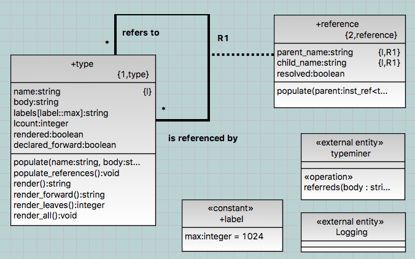

---

This work is licensed under the Creative Commons CC0 License

---

# type export needs to be ordered
### xtUML Project Design Note

### 1. Abstract

MASL type definitions need to be exported into the textual model (`.mod`)
file in an order that is informed by inter-type dependence and reference.
In the present version of BridgePoint, type names are syntactically
recognized, but the bodies of the types are free form text.  This text is
not parsed by the tool.  This free form text may contain references to
other types defined in the model.  For the model editor to be adequately
useful, it must be made intelligent enough to render types in an order
that honors type dependency.  Though free form, the type bodies must be
parsed to find type references that must be declared in dependent order
or declared forward when necessary.

### 2. Document References

<a id="2.1"></a>2.1 [#9947 type export needs to be ordered](https://support.onefact.net/issues/9947)  
<a id="2.2"></a>2.2 [first try implementation note (now reverted)](https://github.com/cortlandstarrett/mc/blob/9947_typeorder/doc/notes/9947_type_decl/9947_type_decl_int.md)  
<a id="2.3"></a>2.3 [analysis note for this issue](https://github.com/cortlandstarrett/mc/blob/9947_typeorder/doc/notes/9947_type_decl/9947_type_decl2_ant.md)  

### 3. Background

For expedience, the parent issue [[2.1]](#2.1) initially was addressed
using a brute force approach described in [[2.2]](#2.2).  The approach
simplistically provided forward declarations for all types.  Simple
is good.  But in this case a simple, brute force approach precipitated
problems in the downstream model compilation tool chain.

Further analysis of the issue was documented in [[2.3]](#2.3).  It is
important to have read the analysis before reviewing this design note.

A different approach is now taken that includes scanning the type bodies
for references to other types.  The design does not employ a full
grammar-based parser but does sufficient pattern matching following
rules of punctuation and spacing.

### 4. Requirements

For convenience, the requirements from [[2.3]](#2.3) are repeated here.

4.1 User defined MASL types shall be exported in an order which minimizes
forward declarations.  
4.1.1 Forward references shall be generated only for types which make a
cyclic reference.  

### 5. Analysis

See [[2.3]](#2.3).

Unforeseen downstream tool-chain issues highlighted the lack of finesse
in the original solution.  A better solution is needed.  The tool must
automate the ordering of the output type definitions without placing a
burden on the human analyst.  This means that BridgePoint must "see" inside
type definition bodies and identify dependent references to other types.

### 6. Design

The design of a solution must address three short-comings in the present
version of BridgePoint.  Firstly, dependent types must be identified in
the definition bodies of all varieties of MASL user defined types.
Secondly, the concept of reference/dependence must be established between
types.  Thirdly, using the reference information, types must be exported
in an order which minimizes forward declarations.

6.1 Identifying Dependent Types  
A scanner (`typeminer`) is introduced which takes as input the body of a
type definition and produces a list of labels that may be the names of
referenced types found within the body.

6.2 Capturing References  
A class is added to model of MASL types that provides a reflexive
association from one type to another that refers to it.  This link is
established between a type and all potential references found inside the
body of the type.

  

6.3 Ordering Algorithm  
The ordering algorithm employes the concept of 'leaf' and 'cycle'.
A leaf is a type that makes no reference to itself or any other
type.  A cycle a set of one or more types that form a looping chain of
references.  Self-reference is a cycle of length one.  Longer cycles are
formed when one type refers to another (which refers to another which
refers another) which eventually refers back to the first type.  As
stated in [[2.3]](#2.3), a single forward declaration can "break" a
cycle.

6.3.1 Self-Reference  
Forward declarations are always required for self-referential types.
The algorithm detects self-reference and initially provides a forward
declaration for these individually recursive types.

6.3.2 Resolution of Leaf Types  
All leaf types are rendered.

6.3.3 Breaking of Cycles  
After leaf types are rendered, remaining types are part of one or more
cycles.  One dependent reference is selected arbitrarily.  The type it
refers to is provided a forward declaration which breaks a cycle in which
it participates.  All unprocessed leaf types are rendered.

The steps of leaf rendering and cycle breaking continue until all types
have been made eligible for rendering and are exported.  A guard is
provided to avoid infinitely attempting to break cycles.  However, the
above algorithm can deterministically succeeded if all legitimate
referenced types are identified _and_ no false positives were parsed from
type bodies.

6.4 Weaknesses  
This design depends upon successfully identifying referenced type names
from within type bodies.  Success means identifying actual type
references and also not mistaking extra words as type or enumerator
identifiers.

6.5 Challenge  
In MASL, enumerator references pose a special challenge.  Type references
within type definitions are found by (single) name for all but
enumerators.  The members of an enumeration represent a set of labels
that can be imbedded within other type definition bodies in
initialization expressions.

### 7. Design Comments

7.1 Enumerator Initializers  
The present solution does not recognize enumerators used in expressions
of other type field initializers.

### 8. User Documentation

No changes to user documentation are necessary.

### 9. Unit Test

9.1 MASL round trip shall pass

9.2 Type export test

9.2.1 In a new workspace, create a new project and import `TypeTest.xtuml`
(download from the issue [[2.1]](#2.1))  
9.2.2 Expand the project and "TypeTest" package  
9.2.3 Right click the component and select "Export MASL domain"  
9.2.4 Verify that the export completes successfully  
9.2.5 Navigate to the `masl/TypeTest` directory under the project and open
`TypeTest.mod`  
9.2.6 Verify that all three user defined types have a type forward declaration
and a type declaration.  It should look something like this:  
```
domain TypeTest is

  private type status;
  private type light_array;
  private type special_status;
  private type status is enum ( ON, OFF, ERROR );
  private type light_array is structure
    light1: status;
    light2: status;
    light3: special_status;
  end structure;
  private type special_status is enum ( ON, OFF, SUPER, ERROR );

end domain;
```

### End
